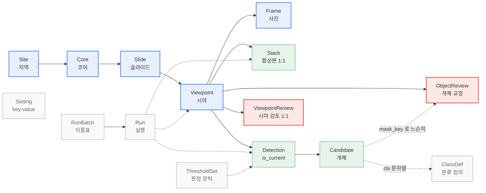
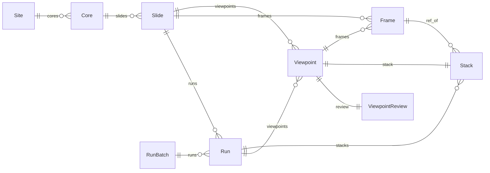
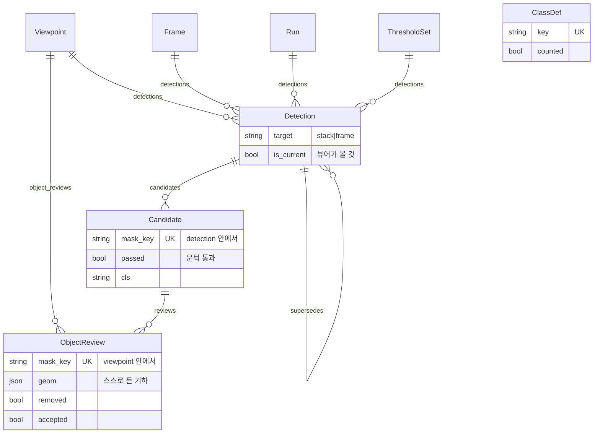
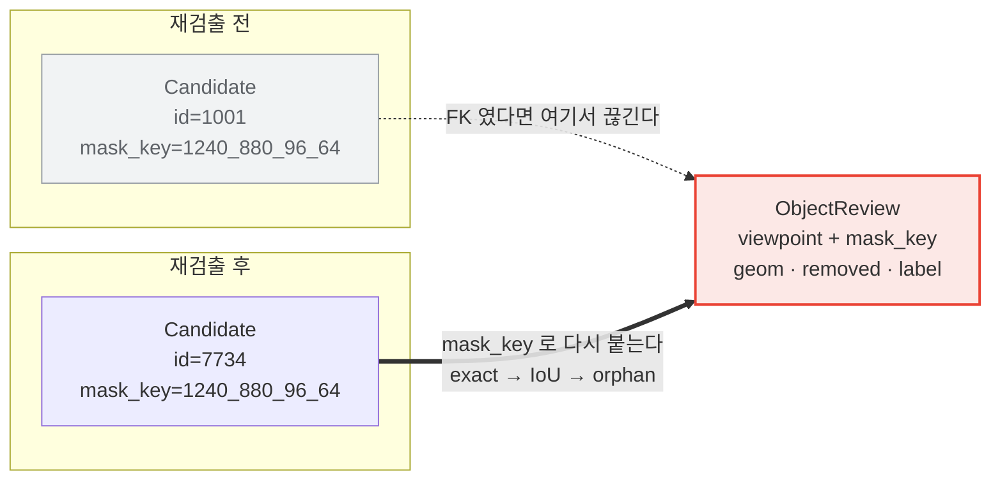
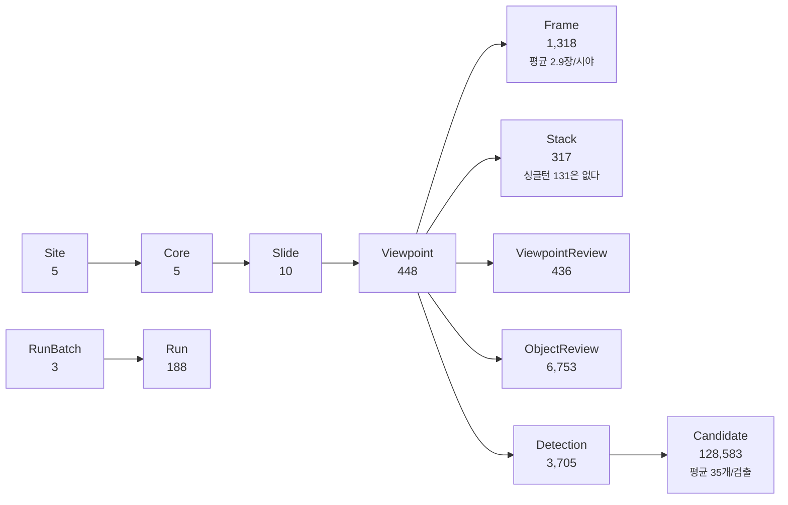

# diatom DB ERD — 한눈에

**2026-08-04** · A3 가로

도표만 모았다. 칸의 뜻은 [DB 명세](20260804_db-specification.md), 관계 하나하나의
방향·`on_delete`·`related_name` 은 [ERD 문서](20260804_db-erd.md)에 있다.

원본은 `web/viewer/models.py` 이고, 이 그림들은 그 두 문서와 **같은 mermaid 원본**
에서 나온다 — 한쪽만 고쳐져 어긋나는 일이 없다.

---

## 전체 그림

파랑이 줄기(시료 계통), 초록이 검출, 빨강이 사람의 교정, 회색이 설정과 이력이다.
실선은 소유(FK — 지우면 따라 지워진다), 점선은 참조이거나 FK 가 아예 아닌 것이다.

---

## 시료 계통과 이력

---

## 검출과 교정

---

## 사람의 교정은 왜 후보에 매이지 않는가

---

## 지금 담긴 것 (2026-08-04)

