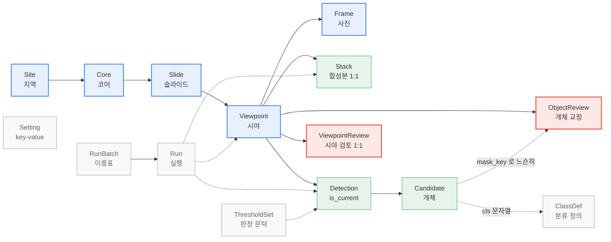
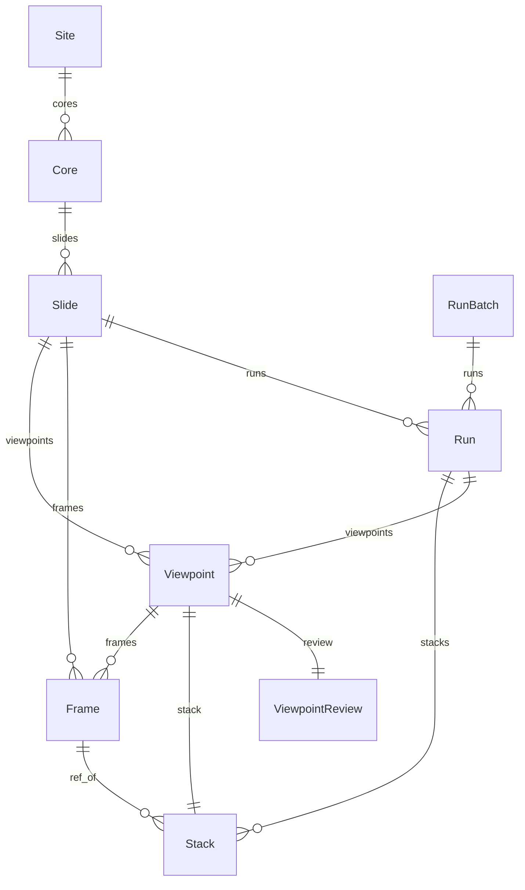
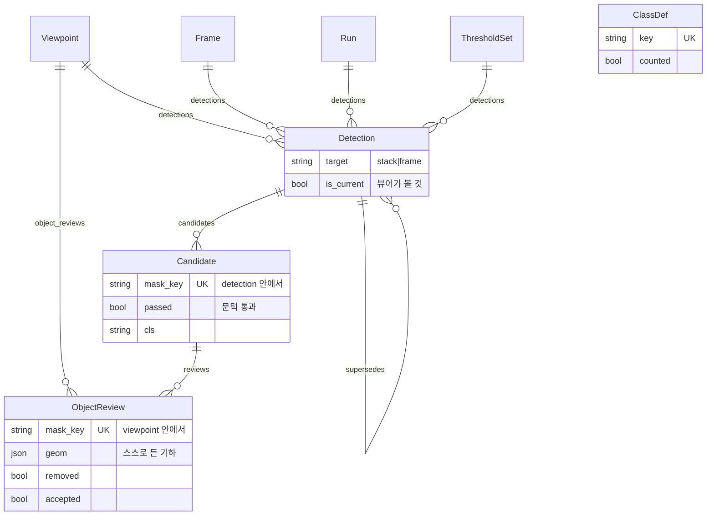
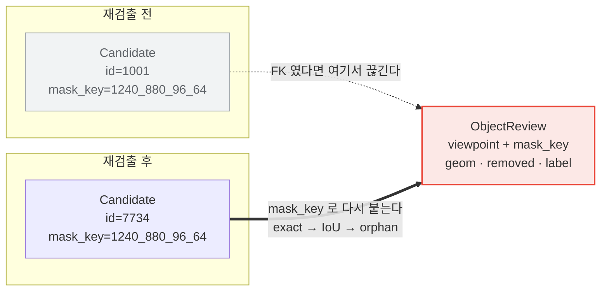
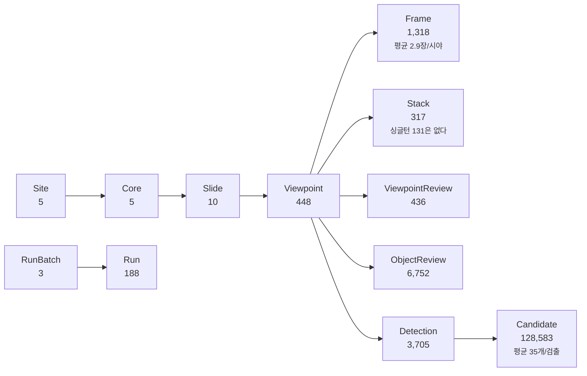

# diatom DB ERD

**2026-08-04**

표 15개와 그 사이의 관계 21개를 그린다. 각 칸의 뜻과 근거는
[DB 명세](20260804_db-specification.md)에 있고, 이 문서는 **무엇이 무엇에
매여 있는가**만 다룬다. 원본은 `web/viewer/models.py`.

---

## 1. 전체 그림

굵은 줄기는 하나다 — **지역 → 코어 → 슬라이드 → 시야 → 사진.** 폴더 이름
`RS23-GC03 71cm` 을 통짜 문자열로 두지 않고 갈라 담은 결과이고, 그래야 "같은
코어에서 깊이에 따른 군집 변화" 나 "지역별 차이" 를 질의할 수 있다.



<!-- 색: 파랑 = 시료 계통(줄기) · 초록 = 검출 · 빨강 = 사람의 교정 · 회색 = 설정과 이력 -->

**파랑**이 줄기(시료 계통), **초록**이 검출, **빨강**이 사람의 교정, **회색**이
설정과 이력이다. 실선은 소유(FK, 지우면 따라 지워진다), **점선은 참조이거나 FK 가
아예 아닌 것**이다. 특히 `Candidate ⇢ ObjectReview` 는 사람의 교정이 후보에 매여
있지 않다는 뜻이다 (§1.3).

### 1.1 시료 계통과 이력

무엇이 무엇에 매이는지만 본다. **칸의 뜻은 [DB 명세](20260804_db-specification.md)**
에 있고, 유일 제약과 인덱스는 아래 §3 이다.



`Viewpoint ||--o{ Frame` 과 `Slide ||--o{ Frame` 이 **둘 다 있는 것**이 눈에 걸릴
수 있다. 사진은 슬라이드에 속하고(필수), 시야에는 그룹핑이 끝난 뒤에 붙는다(null).
그래서 그룹핑 전의 사진도 어디에 있는지 알 수 있다.

### 1.2 검출과 교정

여기서는 칸을 몇 개 적는다 — **이 표들의 성격이 칸 하나에 걸려 있기 때문이다**
(`is_current` · `passed` · `mask_key`).



`ClassDef`(그림에서는 `CD` — mermaid 가 `classDef` 를 스타일 예약어로 쓴다) 와
`Setting` 은 어느 표와도 FK 로 매이지 않아 관계선이 없다 — `Candidate.cls` 와
`ObjectReview.label` 이 **문자열로** `ClassDef.key` 를 가리킬 뿐이다.
`check_db.py` 의 4번 검사가 그 느슨한 연결이 끊기지 않았는지 본다.

### 1.3 사람의 교정은 왜 점선인가



검출을 다시 돌리면 `Candidate` 행이 **전부 새로 생긴다.** FK 로 매었다면 그때마다
사람의 판단이 조인 실패로 사라진다. 그래서 진짜 키는 `(viewpoint, mask_key)` 이고,
`ObjectReview.candidate` 는 **바인딩 결과를 적어 둔 칸**일 뿐이다(`SET_NULL`).

교정 행은 `geom` 에 기하를 스스로 들고 있어 **검출기가 바뀌어도 읽힌다.** 실측으로
같은 설정이면 100 % 붙지만 엔진을 갈면 거의 0 이 된다 — 그때를 위한 설계다.

### 1.4 `Run` 은 아래로 가지를 뻗지 않는다

실행이 만든 것들(`Viewpoint` · `Stack` · `Detection`)이 **각자** `run` 을 가리킨다.
그래서 실행 하나를 지워도(`SET_NULL`) 산출물은 남는다 — 이력이 사라지는 것과
자료가 사라지는 것은 다르다.

---

## 2. 관계 21개

`related_name` 은 역방향으로 부를 이름이다 (`slide.viewpoints.all()`).

| from | 칸 | to | | 필수 | 지우면 | related_name |
|---|---|---|---|---|---|---|
| `Core` | `site` | `Site` | N:1 | 필수 | **CASCADE** | `cores` |
| `Slide` | `core` | `Core` | N:1 | null | SET_NULL | `slides` |
| `Viewpoint` | `slide` | `Slide` | N:1 | 필수 | **CASCADE** | `viewpoints` |
| `Viewpoint` | `sharpest_frame` | `Frame` | N:1 | null | SET_NULL | `sharpest_of` |
| `Viewpoint` | `grouping_run` | `Run` | N:1 | null | SET_NULL | `viewpoints` |
| `Frame` | `slide` | `Slide` | N:1 | 필수 | **CASCADE** | `frames` |
| `Frame` | `viewpoint` | `Viewpoint` | N:1 | null | SET_NULL | `frames` |
| `Stack` | `viewpoint` | `Viewpoint` | **1:1** | 필수 | **CASCADE** | `stack` |
| `Stack` | `ref_frame` | `Frame` | N:1 | null | SET_NULL | `ref_of` |
| `Stack` | `run` | `Run` | N:1 | null | SET_NULL | `stacks` |
| `Detection` | `viewpoint` | `Viewpoint` | N:1 | 필수 | **CASCADE** | `detections` |
| `Detection` | `frame` | `Frame` | N:1 | null | SET_NULL | `detections` |
| `Detection` | `thresholds` | `ThresholdSet` | N:1 | null | SET_NULL | `detections` |
| `Detection` | `run` | `Run` | N:1 | null | SET_NULL | `detections` |
| `Detection` | `superseded_by` | `Detection` | N:1 | null | SET_NULL | `supersedes` |
| `Candidate` | `detection` | `Detection` | N:1 | 필수 | **CASCADE** | `candidates` |
| `ObjectReview` | `viewpoint` | `Viewpoint` | N:1 | 필수 | **CASCADE** | `object_reviews` |
| `ObjectReview` | `candidate` | `Candidate` | N:1 | null | SET_NULL | `reviews` |
| `ViewpointReview` | `viewpoint` | `Viewpoint` | **1:1** | 필수 | **CASCADE** | `review` |
| `Run` | `batch` | `RunBatch` | N:1 | null | SET_NULL | `runs` |
| `Run` | `slide` | `Slide` | N:1 | null | SET_NULL | `runs` |

### `CASCADE` 와 `SET_NULL` 을 가른 기준

**소유는 `CASCADE`, 참조는 `SET_NULL`.**

- `Slide` 를 지우면 그 아래 시야·사진·검출·후보·교정이 **전부 따라 지워진다.**
  슬라이드 없는 시야는 뜻이 없기 때문이다. 그래서 슬라이드 삭제는 무겁다.
- 반대로 `Run`·`ThresholdSet`·`Frame`(참조) 은 **가리키기만 한다.** 실행 이력을
  지워도 검출은 남고, 문턱을 지워도 이미 판정된 후보는 그대로다.
- `Detection.superseded_by` 가 `SET_NULL` 인 것이 중요하다 — 옛 검출을 지울 때
  그것을 가리키던 **현재 검출이 딸려 가지 않는다.**
- `ObjectReview.candidate` 가 `SET_NULL` 인 것도 같은 뜻이다. 후보가 사라져도
  **사람의 교정은 남는다.** 재생성 불가한 자료이므로 이 방향은 양보할 수 없다.

---

## 3. 유일 제약과 인덱스

### 유일 제약

| 표 | 칸 | 왜 |
|---|---|---|
| `Site` | `code` | 지역 코드는 하나 |
| `Slide` | `slug` | URL 에 쓴다 |
| `ClassDef` | `key` | 분류 키는 하나 |
| `Setting` | `key` | |
| `RunBatch` | `(kind, label)` | 같은 종류에 같은 이름의 묶음은 하나 |
| `Core` | `(site, code)` | 지역이 다르면 `GC03` 이 겹쳐도 된다 |
| `Viewpoint` | `(slide, idx)` | `g0` 은 슬라이드 안에서만 유일 |
| `Frame` | `(slide, name)` | **슬라이드를 넘으면 이름이 겹친다** — 실제로 143개가 겹쳤고, 슬라이드를 안 보고 이름만으로 찾다가 시야 12개가 엉뚱한 슬라이드에 붙었다 |
| `Candidate` | `(detection, mask_key)` | 한 검출 안에서 개체 키는 하나 |
| `ObjectReview` | `(viewpoint, mask_key)` | **교정의 진짜 키** |

### 인덱스

| 표 | 칸 | 무엇을 빠르게 하는가 |
|---|---|---|
| `Slide` | `(core, depth_cm)` | 코어 안에서 깊이순 |
| `Run` | `(kind, -started_at)` | 종류별 최근 실행 |
| `Detection` | `(viewpoint, is_current)` | **뷰어가 매 화면마다 하는 질의** |
| `Candidate` | `(detection, passed)` | 통과분만 그리기 |
| `Candidate` | `cls` · `major_um` · `texture` | 계측 표의 정렬·거르기 |
| `ObjectReview` | `(viewpoint, bind_method)` · `bind_method` | 재바인딩 결과 집계 |

---

## 4. 카디널리티 실측 (2026-08-04)

숫자가 관계를 설명한다.



- **`Viewpoint` 448 대 `Stack` 317** — 131개 시야는 사진이 한 장뿐이라(싱글턴)
  합성할 것이 없다. 그때는 그 한 장으로 검출을 돌린다.
- **`Detection` 3,705 대 `Viewpoint` 448** — 한 시야에 여러 묶음(SAM2·YOLO 1차·
  2차)의 검출이 쌓여 있다. 그중 `is_current` 는 시야마다 **정확히 하나**다.
- **`ObjectReview` 6,752** — 삭제 5,466 · 되살림 637 · 분류 지정 1,253 · 메모 2.
  바인딩은 전부 `exact`.

---

---

## 5. 이 문서의 그림에 대하여

도표는 **mermaid 로 쓴다.** 예전에는 ASCII 로 그렸는데 docx 로 옮기면 깨졌다 —
고정폭 글꼴을 줘도 한글과 罫線 문자의 폭이 맞지 않는다.

`md2docx.py` 가 ```` ```mermaid ```` 블록을 만나면 `mmdc` 로 PNG 를 구워 그 자리에
넣는다(`docs/assets/mermaid-<해시>.png`). 원본이 같으면 다시 굽지 않는다.
**구운 그림은 저장소에 함께 넣는다.** 해시가 같으면 다시 굽지 않으므로, `mmdc`
가 없는 장비에서도 같은 docx 가 나온다. 그림이 없고 `mmdc` 도 없으면 코드 블록으로
떨어진다 — 변환이 실패하는 것보다 낫다.

```bash
npm i @mermaid-js/mermaid-cli
MMDC=$(pwd)/node_modules/.bin/mmdc python md2docx.py docs/20260804_db-erd.md
```

**원본은 이 문서 안의 mermaid 한 벌뿐이다.** 그림 파일은 그것에서 나온 산출물이라
따로 손대지 않는다.
