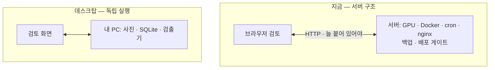
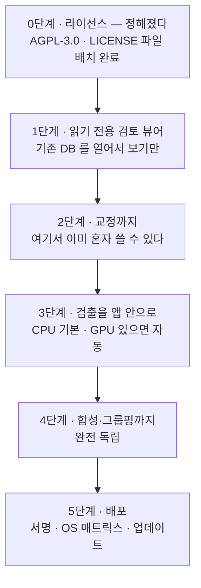

# 검토 화면을 데스크탑 앱으로 — 기술 검토

**2026-08-05** (같은 날 개정 — 아래 0절)

지금 뷰어(`DiaRUGA`)가 하는 일 — **자동 검출 결과를 사람이 보면서 고치는 것** —
을 데스크탑 애플리케이션으로 만드는 것에 대한 검토다.

측정 근거는 `devlog/20260805_049_cpu-inference-benchmark.md`,
재현 도구는 `tools/bench_sam2.py` · `tools/bench_yolo.py` 다.

---

## 0. 이 문서는 한 번 뒤집혔다

**첫 판은 "지금은 만들지 말자" 였다.** 그 결론은 틀린 전제 위에 서 있었다 —
연구소 서버가 계속 있다고 보고, **검토자 한 명의 속도**만 따졌다. 그 전제에서는
웹에서 며칠이면 얻는 개선이 남아 있으니 5,500줄을 다시 쓸 이유가 없었다.

실제 동기는 다른 것이었다:

> **GPU 서버가 없고, 서버를 운영할 줄 모르고, 클라우드는 비싼 연구자에게
> 이 도구를 주는 것.** 각자 자기 PC 에서 자기 데이터로 혼자 쓴다.

이건 **속도 문제가 아니라 배포 문제**다. 그리고 이 전제에서는 결론이 바뀐다.
**만들 값이 있다.** 아래는 그 근거와, 만들기 전에 반드시 정해야 하는 것 하나다.

---

## 1. 이 작업이 실제로 무엇인가

기술 선택은 작업의 모양에서 나온다. DB 실측(2026-08-05):

| | 값 |
|---|---|
| 시야(Viewpoint) | 452 · 그중 343 검토 완료 |
| **시야당 검출 후보** | **203개** |
| **시야당 사람이 손댄 것** | **14.9개** |
| 교정 전체 | 6,731 (삭제 81% · 분류 19% · 되살림 9% · 메모 0.03%) |
| 원본 사진 | 1,318장 · 3.8 GB · 장당 2752×2208 |

> **이 작업은 "많이 보고 조금 고친다" 이다.** 203개를 훑어 15개를 손대고,
> 손대는 것의 81%는 "이건 규조각이 아니다" 라는 한 가지 판단이다.

그러므로 검토 속도를 정하는 것은 입력 방식이 아니라 **훑는 속도**다 — 사진이
얼마나 빨리 뜨는가, 확대·이동이 손에 붙는가, 초점 시리즈를 얼마나 빨리
넘겨보는가. 데스크탑이 이기는 자리가 정확히 거기다.

---

## 2. GPU 없이 검출이 되는가 — 된다

이것이 데스크탑 안이 성립하는지를 가르는 질문이라 실측했다.

| 엔진 | GPU/시야 | CPU/시야 | GPU/슬라이드 | CPU/슬라이드 | 배수 |
|---|---|---|---|---|---|
| SAM2.1 `pps=48` | 13.0초 | **3.4분** | 9.8분 | **2.5시간** | 16배 |
| **YOLO11m-seg 1280** | 0.09초 | **1.7초** | 4.2초 | **75초** | 18배 |

**결과는 CPU·GPU 가 같다** — SAM2 는 양쪽 다 마스크 422개, YOLO 는 양쪽 다
검출 146개. **정확도를 잃는 것이 아니라 느리기만 하다.**

두 가지가 중요하다.

**첫째, YOLO 는 CPU 로 충분하다.** 슬라이드 한 장을 75초에 끝낸다. 그리고
**12스레드(1.665초)와 4스레드(1.657초)가 사실상 같다** — 코어를 늘려도 안
빨라진다는 것은, 뒤집으면 **사무용 노트북에서도 같은 속도가 나온다**는 뜻이다.

**둘째, SAM2 도 "안 되는" 것은 아니다.** 슬라이드당 2.5시간이면 대화형으로는
못 쓰지만 야간 배치로는 쓴다. 그리고 병목이 **인코더가 아니라 디코더**라
(CPU 인코더 2.4초 · 점당 86.9 ms × 2,304점) `--points-per-side` 가 곧 소요다.
48 → 24 면 약 50초/시야가 된다 — 대신 작은 개체를 놓친다.

---

## 3. 저장공간과 비용 — 데스크탑이 유리한 진짜 이유

| | 슬라이드당 | 50 슬라이드 |
|---|---|---|
| 원본 사진 | 380 MB | 19 GB |
| 합성본 | 26 MB | 1.3 GB |
| **합계** | **약 400 MB** | **약 20 GB** |

**PC 에 그냥 들어간다.** 외장 디스크 하나면 수백 슬라이드도 된다.

그리고 클라우드에서 비싼 것은 **저장이 아니라 24시간 떠 있는 GPU 인스턴스**다.
검출은 슬라이드가 들어올 때만 도는데, 서버는 그것을 기다리느라 계속 켜져 있어야
한다. 데스크탑은 **그 항목 자체를 없앤다** — 쓸 때만 자기 PC 가 돈다.

서버 운영 부담도 같은 크기다. 지금 이 시스템은 nginx · Docker · cron 폴러 ·
백업 로테이션 · 무결성 깃발 · 배포 게이트를 갖고 있다. 그것은 **운영할 사람이
있어서** 성립하는 구조다. 밖의 연구자에게 이걸 요구할 수 없다.

---

## 4. 라이선스가 엔진을 정한다 — **먼저 정할 것**

컨테이너 안에서 확인한 값이다.

| | 판 | 라이선스 | 밖으로 배포할 때 |
|---|---|---|---|
| **ultralytics** (YOLO11) | 8.4.7 | **AGPL-3.0** | 앱 전체를 AGPL 로 공개하거나, 상용 라이선스 |
| **SAM-2** | 1.0 | **Apache 2.0** | 제약 없음 |
| torchvision | 0.28.0 | BSD | 제약 없음 |
| PyQt5 | — | **GPL v3** | PySide6(LGPL)로 가면 자유 |

> **성능과 라이선스가 정확히 반대로 걸려 있다.**
> CPU 에서 쓸 만한 쪽(YOLO 1.7초)이 AGPL 이고,
> 라이선스가 자유로운 쪽(SAM2 Apache)이 CPU 에서 3.4분이다.

**사내에서 쓰는 지금은 아무 문제가 없다.** AGPL 의 의무는 **배포하거나 네트워크로
서비스할 때** 걸린다. 밖으로 배포하는 순간 걸린다.

선택지는 셋이었다.

| 길 | 대가 | 어울리는 경우 |
|---|---|---|
| **① 앱 전체를 AGPL-3.0 으로 공개** | 소스가 공개된다 | **학술 도구라면 오히려 자연스럽다** |
| ② Ultralytics 상용 라이선스 | 비용 | 소스를 못 여는 사정이 있을 때 |
| ③ ultralytics 를 안 싣는다 | 다시 학습해야 한다 | 소스는 열기 싫고 돈도 안 쓸 때 |

### **결정: ①, AGPL-3.0 으로 간다** (2026-08-05)

이것으로 나머지가 전부 풀린다.

- **검출기를 다시 학습하지 않는다.** 지금 가중치·`export_yolo.py`·
  `segment_diatoms.py` 를 그대로 쓴다
- **PyQt5(GPL v3)도 쓸 수 있게 된다** (AGPLv3 와 호환). 스택 선택에서
  라이선스가 빠지고 기술만 남는다 — 7절
- ③ 의 미해결 항목(**ultralytics 로 학습한 가중치까지 AGPL 이 따라가는가**)을
  판단하지 않아도 된다. 어차피 전부 공개하므로 다툴 여지가 없다

**대신 지금 해 둘 것이 하나 있다.**

> **이 저장소에는 `LICENSE` 파일이 없다.** public 이지만 라이선스가 없으면
> 법적으로는 아무에게도 사용 권한이 없다 — "공개" 와 "오픈소스" 는 다르다.
> 배포하려면 **실제로 AGPL-3.0 파일을 넣고 헤더 방침을 정해야** 한다.
> 데스크탑 앱을 시작하기 전에 끝낼 수 있는 일이고, 미루면 배포 직전에 걸린다.

**그리고 방향이 하나 있다 — MIT 에서 AGPL 로는 가져올 수 있지만, 반대는 안 된다.**
`Modan2` 는 MIT 다. 거기 코드를 이 앱으로 가져오는 것은 되지만, **이 앱의 코드를
Modan2 로 되돌려 넣으면 Modan2 가 오염된다.** 두 프로젝트 사이에 코드를 옮길 때
방향을 지킬 것.

> 곁다리로 — 지금 `ultralytics` 를 부르는 것은 `segment_diatoms.py` ·
> `export_yolo.py` · `pr_sweep.py` · `tools/bench_yolo.py` 넷뿐이고 **전부
> 파이프라인 쪽이다. 웹 뷰어는 부르지 않는다.** 그래서 AGPL 의 네트워크 조항이
> 지금 뷰어에는 닿지 않는다. 나중에 뷰어를 다르게 다루고 싶어질 때를 위해
> **이 분리를 유지해 두는 편이 좋다.**

---

## 5. 서버가 없으면 가장 어려운 문제가 사라진다

첫 판에서 **가장 위험하다고 적었던 것**은 교정 동기화였다. 지금 저장 계약이
"그 시야의 교정 전체를 갈아치운다" 라서, 오프라인 큐를 붙이면 재생성 불가한
자료를 가장 잃기 쉬운 방식으로 다루게 된다는 것이었다.

**혼자 자기 PC 에서 쓰면 그 문제가 아예 없다.** DB 가 하나뿐이고, 쓰는 쪽도
하나뿐이다. 동기화도 병합도 충돌도 없다. **이것이 이 안의 가장 큰 기술적 이점이다** —
속도가 아니라, 없어지는 문제 쪽이 크다.

대신 **파이프라인 전체가 앱 안으로 들어온다.** 검토 화면만 옮기는 것이 아니다 —
초점 시리즈 묶기 · 합성(all-in-focus) · 검출 · 문턱 적용까지. 실측 기준으로
합성이 슬라이드당 약 3분(`Run` 기록 평균 187초)이라 CPU 로도 감당은 된다.

---

## 6. 무엇을 다시 만들어야 하는가

| | 규모 |
|---|---|
| 검토 화면 템플릿(`_detection.html`) | 1,819줄 (HTML+JS) |
| 공통 셸(`base.html`) | 1,070줄 |
| 뷰 · 자료 변환(`views.py` · `data.py`) | 2,622줄 |
| **검토 기능 합계** | **약 5,500줄** |

프레임워크에 기댄 것이 거의 없다 — **바닐라 JS 와 SVG 다.** 옮겨 붙일 수 없다.

그 코드에는 **한 번씩 당하고 얻은 판단이 박혀 있다** — 캐시된 dict 를 고치지 않는
것, 지운 개체를 골랐을 때 "선택 없음" 이라고 하지 않는 것 같은. 다시 쓰면 그
사고들을 다시 겪는다. **`_detection.html` 의 주석을 설계 문서로 읽고 시작할 것.**

반대로 **파이썬 쪽은 거의 그대로 간다** — `judge.py` · `data.py` · `models.py` ·
`focus_stack.py` · `segment_diatoms.py`. 데스크탑도 파이썬이면 **판정 규칙이
한 벌로 유지된다.** 이것이 스택 선택의 핵심 근거다.

---

## 7. 스택

**AGPL 로 정해졌으므로 라이선스는 더 이상 변별점이 아니다.** PyQt5(GPL v3)도
쓸 수 있다. 남은 것은 기술 판단뿐이다.

| 선택지 | 값 | 걸리는 것 |
|---|---|---|
| **PySide6** (Qt6) | 파이썬이라 `judge.py` 를 **그대로 쓴다**. **Qt6 라 앞으로 오래 간다** — 밖으로 배포해 몇 년 유지할 물건이면 이쪽 | Modan2 위젯 코드를 그대로 붙일 수는 없다 (API 는 95% 같다) |
| **PyQt5** (Qt5) | **Modan2 23,000줄의 위젯 코드를 직접 가져온다.** 사내 경험이 가장 두껍다 | **Qt5 는 이미 레거시다.** 오래 유지할 새 물건의 바닥으로는 약하다 |
| Electron | 지금 JS·SVG 를 거의 그대로 옮긴다 | 2절의 이득(원본 확대·초점 훑기)을 대부분 못 얻는다. 파이썬 파이프라인과 두 벌이 된다 |
| Tauri | 가볍고 배포가 깔끔 | Rust 를 새로 들인다. **사내 자산이 없다** |

**PySide6 를 권한다.** 이유는 둘이다 — **판정 규칙(`judge.py`)을 한 벌로 유지**
하는 것과, **Qt6 가 앞으로 오래 갈 바닥**이라는 것.

**Modan2 에서 진짜 값나가는 자산은 위젯 코드가 아니라 빌드·배포 파이프라인**
(PyInstaller · InnoSetup · AppDir)인데, **그것은 바인딩과 무관하게 그대로
옮겨진다.** PyQt5 ↔ PySide6 의 코드 차이는 대부분 임포트 이름 수준이라,
Modan2 위젯을 참고하는 데도 큰 지장이 없다.

---

## 8. 배포가 새 직업이 된다

`devdocs/guides/desktop/` 이 있다는 것은 좋은 소식이자 나쁜 소식이다 —
**형제 프로젝트들이 그만큼 당해서 생긴 문서다.** 밖으로 배포하면 전부 해당된다:

- **OS 매트릭스에서 시험하지 않으면 시험한 것이 아니다** (Windows/macOS/Linux)
- **maintainer 노트북에서 빌드하지 않는다** — conda DLL 지옥이 실제 사례로 있다
- **얼린(frozen) 산출물이 실제로 뜨는지**를 관문으로 둔다
- 설치 위치·설정 위치·**사용자 데이터 위치는 서로 다른 세 답**이다
- 코드 서명 — 밖으로 나가면 서명 없는 설치 파일은 경고를 뿜는다
- 판 번호 단일 출처 · 태그 기반 릴리스 · 업데이트 경로

여기에 이 앱만의 것이 더 붙는다:

- **모델 가중치를 어떻게 실을 것인가.** YOLO 가중치 45 MB · SAM2 309 MB.
  설치 파일에 넣을지 첫 실행 때 받을지 — 사내망 TLS 가로채기를 겪은 조직이라
  **오프라인 설치 경로가 필요하다**
- **torch 를 싣는 부피.** CPU 전용 휠로도 수백 MB 다. GPU 판까지 지원하면
  설치 파일이 갈라진다

---

## 9. 만든다면 — 이 순서로

| 단계 | 얻는 것 | 위험 |
|---|---|---|
| 0 | **나머지 전부의 전제** | **끝났다** — AGPL-3.0, `LICENSE` 배치 (2026-08-05) |
| 1 | 원본 확대·초점 훑기 — 큰 이득을 먼저 | 거의 없다. 쓰지 않는다 |
| 2 | **혼자 쓰는 도구로 이미 완성** | 낮다. DB 가 하나뿐이다 |
| 3 | GPU 없는 PC 에서 검출 | 중간. 엔진·가중치 배포 |
| 4 | 서버가 아예 필요 없다 | 중간 |
| 5 | 밖으로 나간다 | **높다. 8절 전부** |

**2단계에서 멈춰도 쓸 만한 도구가 된다.** 사진과 DB 를 손으로 옮겨 주면 혼자
쓰는 검토 도구로 완성이다. 밖으로 내보내는 것은 5단계이고, 그때 비용이 몰린다.

---

## 10. 권고

**만들 값이 있다.** 다만 순서를 지킨다.

**첫째, 라이선스는 정해졌다 — AGPL-3.0**(4절). 남은 실무는 **저장소에 `LICENSE`
파일을 넣는 것**이다. 지금은 public 이지만 라이선스가 없어 법적으로는 아무도
쓸 수 없는 상태다. 데스크탑 앱을 시작하기 전에 끝낼 수 있고, **미루면 배포
직전에 걸린다.** Modan2(MIT)와 코드를 주고받을 때는 **MIT → AGPL 방향만**
가능하다는 것도 같이 정해 둔다.

**둘째, 검출 엔진은 YOLO 로 간다.** 근거가 이제 셋이다 — P04 에서 이미 확인한
**정밀도 1.7배 · 속도 320배**, 그리고 여기서 확인한 **CPU 1.7초(SAM2 는 3.4분)**.
GPU 를 선택사항으로 만드는 것이 이 앱의 성립 조건인데, 그것을 YOLO 만 만족한다.
AGPL 로 정했으므로 이 선택에 더 붙는 대가가 없다.

**셋째, PySide6 로 · 1단계부터 · `devdocs/guides/desktop/` 을 처음부터 지킨다.**
그 문서는 형제 프로젝트들이 같은 사고를 겪고 도달한 곳이라, 나중에 읽으면 이미
늦은 항목들이 들어 있다.

**넷째, 지금 웹 뷰어를 버리지 않는다.** 연구소 안에서는 서버 구조가 잘 돌고
있고(폴러·백업·무결성 깃발), 자료가 쌓이는 곳도 여기다. **데스크탑은 대체가
아니라 배포판이다.** 파이썬을 공유하면 두 벌을 유지하는 비용이 가장 낮다.

---

## 11. 결론을 뒤집는 조건

| 조건 | 어떻게 바뀌는가 |
|---|---|
| 라이선스를 못 정한다 | **시작하지 않는다.** 5단계에서 되돌아오는 비용이 가장 크다 |
| 배포 대상이 사내로 좁혀진다 | 8절(서명·OS 매트릭스)이 거의 사라진다. 2단계까지만 만들어도 된다 |
| 검토자가 여럿이 되고 자료를 공유해야 한다 | 5절의 이점이 사라진다 — 동기화 설계가 다시 필요하고, 그때는 서버 구조가 낫다 |
| 슬라이드가 수백 장 단위가 된다 | 3절의 전제(20 GB)가 흔들린다. 저장 설계를 다시 본다 |
| SAM2 급 정확도가 꼭 필요해진다 | CPU 로는 슬라이드당 2.5시간이다. **GPU 를 요구사항으로 올려야 한다** |
