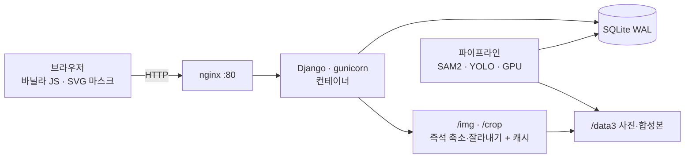
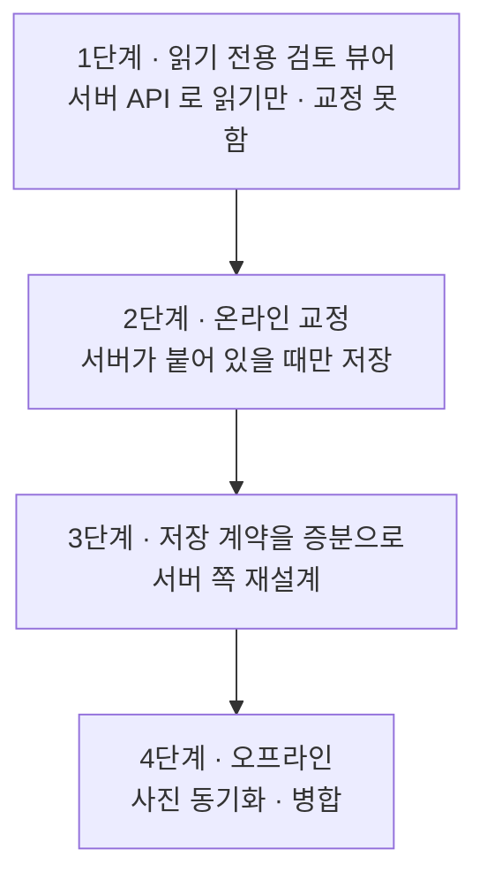

# 검토 화면을 데스크탑 앱으로 — 기술 검토

**2026-08-05**

지금 뷰어(`DiaRUGA`)가 하는 일 — **자동 검출 결과를 사람이 보면서 고치는 것** —
을 데스크탑 애플리케이션으로 만드는 것에 대한 검토다. 결론부터 말하면
**만들 수 있고, 이 조직은 만들 자산도 갖고 있다.** 다만 **지금 만들면 얻는 것보다
새로 지는 위험이 크다.** 무엇을 재서 그렇게 판단했는지를 적는다.

> 이 문서는 **결정을 내리기 위한 재료**다. 아래 4절의 질문 세 개에 답이 정해지면
> 결론이 바뀔 수 있고, 그때 어느 쪽으로 바뀌는지도 적어 두었다.

---

## 1. 먼저 — 이 작업이 실제로 무엇인가

기술 선택은 작업의 모양에서 나온다. 그래서 DB 를 재는 것부터 했다
(2026-08-05 실측).

| | 값 |
|---|---|
| 시야(Viewpoint) | 452 · 그중 343 검토 완료 |
| **시야당 검출 후보** | **203개** |
| **시야당 사람이 손댄 것** | **14.9개** |
| 교정 전체 | 6,731 |
| 원본 사진 | 1,318장 · 3.8 GB · 장당 2752×2208 |
| 합성본(all-in-focus) | 642장 · 261 MB |

교정의 성격:

| 조작 | 건수 | 비율 |
|---|---|---|
| **삭제** (오검출이다) | 5,451 | **81.0%** |
| 분류 지정 | 1,249 | 18.6% |
| 되살림 (검출기가 놓친 것) | 635 | 9.4% |
| 메모 | 2 | 0.03% |

**여기서 나오는 결론이 이 문서 전체를 지배한다.**

> **이 작업은 "많이 보고 조금 고친다" 이다.** 203개를 훑어서 15개를 손댄다.
> 나머지 188개는 **보고 그냥 넘어간다.** 그리고 손대는 것의 81%는 "이건
> 규조각이 아니다" 라는 한 가지 판단이다.

그러므로 검토 속도를 정하는 것은 **입력 방식이 아니라 훑는 속도**다 — 사진이
얼마나 빨리 뜨는가, 확대·이동이 손에 붙는가, 초점 시리즈를 얼마나 빨리
넘겨보는가. **데스크탑이 이길 수 있는 자리가 있다면 정확히 거기다.**

---

## 2. 지금 것이 어떻게 되어 있는가

| | 규모 |
|---|---|
| 검토 화면 템플릿(`_detection.html`) | 1,819줄 (HTML+JS 한 파일) |
| 공통 셸(`base.html`) | 1,070줄 |
| 뷰(`views.py`) · 자료 변환(`data.py`) | 1,065 + 1,557줄 |
| **검토 기능 합계** | **약 5,500줄** |

의존 프레임워크가 없다 — **바닐라 JS 와 SVG 다.** 이것이 뒤에서 중요해진다.

**이미 하는 일**(데스크탑으로 옮기면 전부 다시 만들어야 하는 것):

- 원본 2752×2208 을 1600px 로 줄여 띄우고, 확대·이동·확대율 표시
- 후보 203개의 마스크를 SVG 폴리곤으로 겹쳐 그리고 분류별 색·투명도
- 레이어 토글(마스크를 끄고 원본을 확인)
- 초점 시리즈 캐러셀 — 같은 자리를 초점 다르게 찍은 프레임을 넘겨본다
- 개체 선택(단일·Shift 다중), 삭제/되살림, 분류 지정 단축키, 메모
- 개체 목록 탭 · 검출 갤러리(`/crops`) · 계측 표
- 시야 간 이동과 지연 저장(떠나기 전에 밀어냄)
- 문턱 조정 미리보기, 엔진 견주기(`/engine/`, 읽기 전용)

---

## 3. 데스크탑으로 옮기면 무엇을 얻는가

정직하게 **네 가지뿐**이고, 그중 값이 큰 것은 둘이다.

### 3.1 원본 해상도를 직접 다룬다 (가장 큰 이득)

지금은 1600px 축소본을 띄우고, 확대하면 **더 큰 축소본을 HTTP 로 다시 받는다.**
데스크탑은 2752×2208 원본을 메모리에 얹고 GPU 로 확대·이동한다 — 왕복이 없다.

**203개를 훑는 작업에서 이 차이는 누적된다.** 시야 하나에 20번 확대한다면
452 시야 × 20 = 9,040번의 왕복이 사라진다.

### 3.2 초점 시리즈를 진짜로 "넘겨본다"

규조각인지 아닌지는 **초점을 위아래로 흔들어 보면** 판별되는 경우가 많다.
지금은 프레임마다 이미지를 새로 받는다. 데스크탑이라면 시리즈를 통째로 메모리에
올려 두고 **휠로 초점을 훑을 수 있다.** 이것은 웹에서 흉내 내기 어렵고,
분류 정확도에 직접 영향을 준다.

### 3.3 사내망 밖에서도 쓴다

지금 뷰어는 사내 VPN 안에서만 열린다. 데스크탑 앱 + 로컬 사본이면 **현장·출장·
집에서도** 검토가 된다. 밀린 109 시야가 "자리에 앉아야만 줄어드는" 상태를 푼다.

> 사진 전체가 **3.8 GB** 다. 노트북 한 대에 통째로 들어간다 — 이 규모가
> 오프라인을 현실적인 선택지로 만든다. 100 GB 였다면 이 절은 성립하지 않는다.

### 3.4 배포가 사람에게 붙는다

협업자에게 "이 주소로 들어오세요" 가 아니라 설치 파일을 준다. 다만 **이건
장점이자 곧 5절의 비용**이다.

---

## 4. 결정을 가르는 질문 셋

**이 세 답이 정해지기 전에는 어떤 스택 논의도 이르다.**

| 질문 | 답이 "예" 면 | 답이 "아니오" 면 |
|---|---|---|
| **① 검토자가 둘 이상인가?** | 서버가 진실의 원본이어야 한다. 동기화·충돌 설계가 필수 | 로컬 SQLite 한 벌로 끝난다. 난도가 절반 이하로 떨어진다 |
| **② 사내망 밖에서 써야 하는가?** | 오프라인 큐와 병합이 필요하다 — **여기가 가장 위험하다**(6.3) | 서버 API 를 그냥 부르면 된다. 데스크탑의 이득은 3.1·3.2 로 줄어든다 |
| **③ 지금 느린 것이 화면인가, 사람인가?** | 화면이면 데스크탑이 답이다 | 사람이면 **데스크탑은 답이 아니다**(9절) |

③ 에 대해서는 이미 증거가 있다. 지금 다른 작업으로 **삭제에 스페이스 단축키를
붙이는 일**이 진행 중인데, 그 근거가 "교정의 81%가 삭제인데 우클릭 메뉴로만
된다" 였다. **웹에서 몇십 줄로 얻는 속도 향상이 아직 남아 있다는 뜻이다.**

---

## 5. 무엇을 새로 지는가

### 5.1 5,500줄을 다시 쓴다

검토 화면의 로직은 프레임워크에 기댄 것이 거의 없어서 **옮겨 붙일 수 없다.**
SVG 마스크 렌더링, 확대·이동, 선택 모델, 지연 저장이 전부 다시 만들 대상이다.
그리고 그 코드에는 **한 번씩 당하고 얻은 판단이 박혀 있다** — 캐시된 dict 를
고치지 않는 것, 지운 개체를 고르면 "선택 없음" 이라고 하지 않는 것 같은.
다시 쓰면 **그 사고들을 다시 겪는다.**

### 5.2 배포가 새 직업이 된다

`devdocs/guides/desktop/` 이 이미 있다는 것은 좋은 소식이자 나쁜 소식이다 —
**형제 프로젝트들이 그만큼 당했기 때문에 생긴 문서다.** 거기 서 있는 항목들:

- **OS 매트릭스에서 시험하지 않으면 시험한 것이 아니다** (Windows/macOS/Linux)
- **maintainer 노트북에서 빌드하지 않는다.** conda DLL 지옥이 실제 사례로 적혀 있다
- **얼린(frozen) 산출물이 실제로 뜨는지**를 관문으로 둔다
- 설치 위치·설정 위치·사용자 데이터 위치는 **서로 다른 세 답**이다
- 코드 서명, 판 번호 단일 출처, 태그 기반 릴리스

지금 웹 배포는 `deploy.sh` 한 줄에 스냅샷·기동 게이트·smoke 까지 붙어 있다.
데스크탑은 **그 관문을 OS 세 개에 대해 다시 세우는 일**이다.

### 5.3 GPU 와 파이프라인은 서버에 남는다

SAM2·YOLO 는 RTX 급 GPU 를 쓴다. 검출을 데스크탑으로 가져올 수는 없다.
그러므로 데스크탑 앱은 **어떤 형태로든 서버와 이어져야 하고**, "완전한 로컬
앱" 이라는 그림은 처음부터 성립하지 않는다.

---

## 6. 기술적으로 어려운 자리

### 6.1 마스크 렌더링 — 어렵지 않다

시야당 폴리곤 203개는 Qt 의 `QGraphicsScene` 에게 **아무것도 아니다.** 오히려
브라우저 SVG 보다 빠르다. 여기는 걱정할 자리가 아니다.

### 6.2 이미지 — 유리하지만 메모리를 본다

2752×2208 RGB 는 장당 약 18 MB(비압축). 초점 시리즈가 시야당 3~5장이면
**한 시야에 50~90 MB.** 미리 읽기를 두세 시야로 잡으면 수백 MB 다. 다룰 수
있는 크기지만 **설계에 넣어야 하는 크기**이기도 하다.

### 6.3 교정 동기화 — **여기가 진짜 위험이다**

지금 저장 계약은 이렇다:

> **`/review` POST 는 그 시야의 교정 전체를 갈아치운다.** "뷰어는 늘 전체를
> 보낸다" 는 전제이고, 깨지면 나머지를 지운다.

이 계약은 **화면과 서버가 늘 붙어 있다**는 전제 위에 서 있다. 오프라인 큐를
붙이는 순간 전제가 깨진다. 그리고 이 자료는:

- **재생성 불가다.** 343 시야를 사람이 검토해 만든 6,731건이다
- **이미 두 번 잃었다.** 빈 키 목록을 운영 DB 로 보내 14건, "읽기 전용" 이라
  적어 놓고 CSS 로 버튼만 감춘 화면이 37건

**전체 갈아치우기 + 오프라인 병합은 같이 두면 안 되는 조합이다.** 오프라인을
하려면 저장 계약부터 **증분(무엇을 더하고 무엇을 뺐는가)** 으로 바꿔야 하고,
그것은 서버 쪽 재설계다 — 데스크탑 앱보다 먼저 해야 할 일이다.

### 6.4 사진 동기화

3.8 GB 는 옮길 만하지만 **한 번이 아니다.** 파이프라인이 새 슬라이드를 계속
넣는다. 증분 동기화·무결성 확인·부분 다운로드가 필요하고, 이미 있는
`sync_backup_nas.py` 의 계단식 보관과는 다른 문제다.

---

## 7. 스택 — 이 조직 맥락에서

| 선택지 | 이 조직에서의 값 | 걸리는 것 |
|---|---|---|
| **PySide6 / PyQt** | **Modan2 가 이미 PyQt5 23,000줄이다.** 파이썬이라 `judge.py`·`data.py` 의 판정 규칙을 **그대로 가져다 쓴다** — 규칙이 두 벌이 되지 않는다. `devdocs/guides/desktop/` 이 정확히 이 스택 기준으로 쓰였다 | PyQt5 는 GPL 이다. 밖으로 배포하면 **PySide6(LGPL)** 로 가는 편이 안전하다 |
| **Electron** | 지금 JS·SVG 자산을 **거의 그대로** 옮긴다 | 3.1·3.2 의 이득을 대부분 못 얻는다. 여전히 브라우저다. 용량도 크다 |
| **Tauri** | 가볍고 배포가 깔끔하다 | Rust 를 새로 들인다. **이 조직에 자산이 없다** |
| **웹뷰 셸**(기존 화면 감싸기) | 가장 싸다. 며칠 |  **얻는 것이 사실상 없다** — 서버도 그대로 필요하고 성능도 그대로다. "설치 파일" 이라는 겉모습만 산다 |

**PySide6 가 명백히 앞선다.** 이유는 성능이 아니라 **판정 규칙을 한 벌로 유지할
수 있다**는 것이다. `judge.py` 가 유일한 정의라는 지금 구조를, 데스크탑에서
JS 로 다시 구현하는 순간 잃는다.

---

## 8. 만든다면 — 이 순서로

**한 번에 만들지 않는다.** 위험이 큰 것을 뒤로 미루는 순서다.

| 단계 | 얻는 것 | 위험 |
|---|---|---|
| 1 | **3.1·3.2 의 이득을 전부 얻는다** — 원본 확대와 초점 훑기 | 거의 없다. 쓰지 않는다 |
| 2 | 실제 검토를 데스크탑에서 | 낮다. 지금 계약 그대로 |
| 3 | 오프라인의 전제 | 서버 재설계. **여기가 진짜 일이다** |
| 4 | 사내망 밖 검토 | 높다. 교정 병합 |

**1단계에서 멈춰도 이득의 큰 쪽을 얻는다.** 그리고 1단계는 읽기 전용이라
**재생성 불가한 자료를 위험에 놓지 않는다** — 시작점으로 이보다 나은 자리가 없다.

---

## 9. 권고

**지금은 만들지 않는 쪽을 권한다.** 대신 순서를 이렇게 본다.

**첫째, 4절 ③ 을 먼저 답한다.** 검토가 느린 것이 화면 때문인지 사람 때문인지를
**재고 나서** 정한다. 재는 방법은 싸다 — 시야 하나를 검토하는 데 걸리는 시간을
기록하고, 그 안에서 "사진 기다리는 시간" 이 얼마인지 본다. 데스크탑을 만들 이유가
있다면 그 숫자가 말해 줄 것이고, 없다면 5,500줄을 다시 쓰지 않아도 된다.

**둘째, 웹에서 아직 싼 것이 남아 있다.** 삭제 단축키가 그 증거다. 교정의 81%가
한 조작인데 그것이 가장 비싼 입력이었다. 같은 종류로 남아 있을 법한 것:
초점 시리즈를 휠로 넘기기, 다음 미검토 시야로 바로 가기, 마스크 토글 단축키.
**며칠짜리 개선이 아직 수확되지 않았다.**

**셋째, 그래도 만들기로 하면 8절의 1단계부터 · PySide6 로 · `devdocs/guides/
desktop/` 을 처음부터 지킨다.** 그 문서는 형제 프로젝트들이 같은 사고를 겪고
도달한 곳이라, 나중에 읽으면 이미 늦은 항목들이 들어 있다.

**하지 말아야 할 것 하나만 꼽으면 — 오프라인 교정을 먼저 만드는 것이다.**
지금 저장 계약(전체 갈아치우기) 위에 오프라인을 얹으면, 잃을 수 없는 자료를
가장 잃기 쉬운 방식으로 다루게 된다.

---

## 10. 부록 — 판단을 뒤집는 조건

이 문서의 결론은 아래 중 **하나만 참이 되어도 바뀐다.**

| 조건 | 결론이 어떻게 바뀌는가 |
|---|---|
| 검토자가 3명 이상으로 늘어난다 | 서버가 진실의 원본인 구조가 **어차피** 필요해진다. 그때는 데스크탑 클라이언트가 자연스러운 답이 된다 |
| 사내망 밖 검토가 **요구사항**이 된다 | 8절 3단계(증분 저장 계약)를 먼저 해야 하고, 데스크탑은 그 뒤 |
| 시야 하나당 "사진 기다리는 시간" 이 30% 를 넘는다 | 3.1 의 이득이 실측으로 증명된 것이다. 1단계를 바로 시작할 근거가 된다 |
| 슬라이드가 수십 장 단위로 늘어난다 | 사진이 3.8 GB 를 크게 넘기면 **오프라인 전제가 무너진다.** 데스크탑의 이득이 3.1·3.2 로 줄어든다 |
