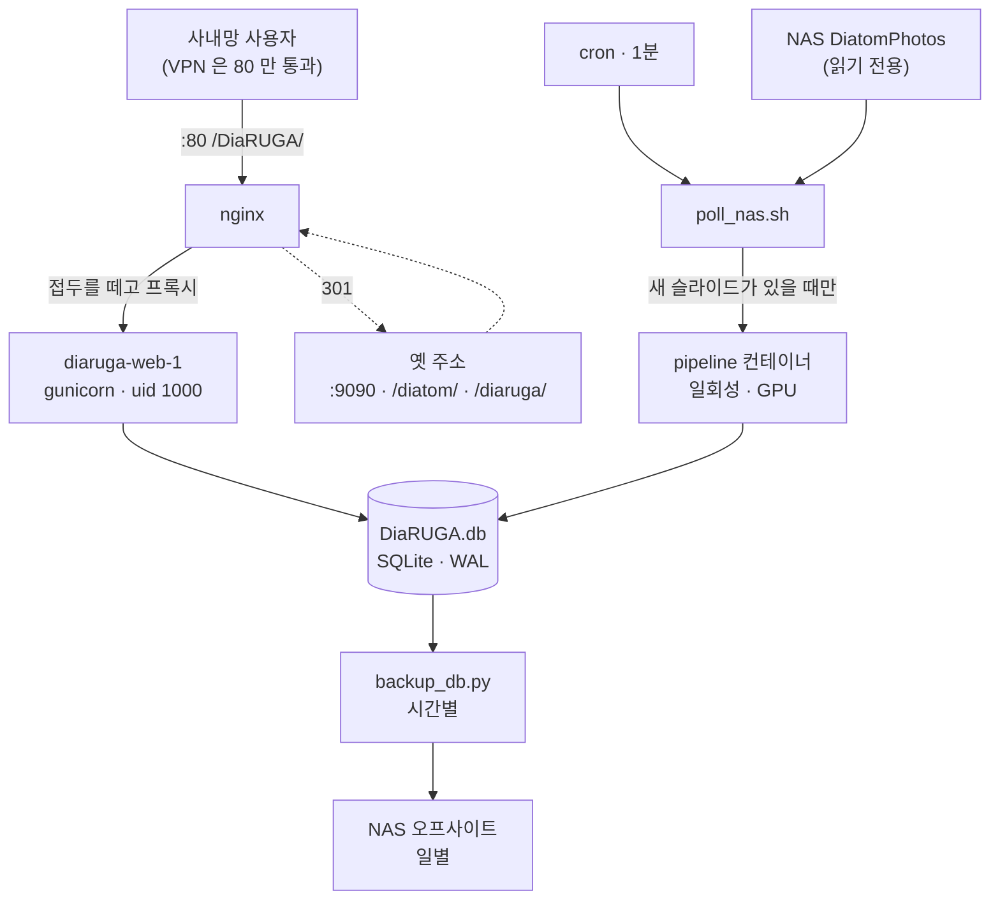
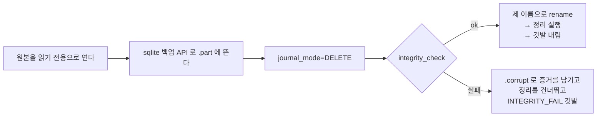

# DiaRUGA 시스템 운영 — Docker 와 백업

**2026-08-05**

이 시스템을 **돌리고 지키는 방법**을 적는다. 무엇을 치면 되는가보다 **왜 그렇게
되어 있는가**에 무게를 둔다 — 순서를 바꾸거나 한 걸음을 빼면 무엇이 깨지는지를
알아야 급할 때 판단할 수 있기 때문이다.

여기 적힌 규칙은 대부분 **실제로 한 번씩 당하고 나서 생긴 것**이다. 그런 자리에는
근거가 되는 devlog 번호를 달아 두었다.

> **원본은 코드다.** `deploy/` 의 compose·Dockerfile·스크립트와 `backup_db.py` ·
> `sync_backup_nas.py` 가 진실이고, 이 문서와 어긋나면 코드가 맞다.
> 지금 상태와 인수 사항은 `HANDOFF.md` 9절에 더 짧게 있다.

---

## 1. 전체 배치



**두 갈래가 같은 DB 를 본다** — 사람이 쓰는 뷰어와, NAS 를 감시해 스스로 도는
파이프라인이다. SQLite 라 **읽기는 여럿, 쓰기는 하나**다. 이것이 뒤에 나오는
여러 규칙의 뿌리다.

| 자리 | 무엇 |
|---|---|
| `/srv/DiaRUGA/` | 배포. `db/` · `scripts/` · `bin/` · `docker-compose.yml` · `.env` |
| `/data3/DiaRUGA/` | 사진·산출물·백업·로그·HF 캐시·학습 자료 |
| `/nfs/temp-share/DiatomPhotos/` | 촬영 원본. **읽기 전용으로만 문다** |
| `/nfs/temp-share/DiaRUGA/backup/` | 오프사이트 사본 |
| `~/projects/DiaRUGA` | 저장소. **여기서 만들고, `/srv` 에서 돌린다** |

**컨테이너 안팎의 경로가 같다.** `/srv/DiaRUGA/db` 는 컨테이너 안에서도
`/srv/DiaRUGA/db` 다. 명령을 호스트와 컨테이너 사이에 그대로 옮겨 쓸 수 있고,
로그에 찍힌 경로를 그대로 열어 볼 수 있다.

---

## 2. Docker

### 2.1 이미지가 두 벌이고, 판도 따로다

| 이미지 | 무엇 | 크기 감각 |
|---|---|---|
| `honestjung/diaruga` | 뷰어. Django · pillow · gunicorn | 가볍다 |
| `honestjung/diaruga-pipeline` | 그룹핑·합성·SAM2·YOLO 검출 | torch 때문에 무겁다 |

**웹 이미지에 torch 를 넣지 않으려고 갈랐다.** requirements 가 넷으로 나뉜 것도
같은 이유다 — 호스트는 `requirements.txt`, 컨테이너가 `-web` 과 `-pipeline` 을
나눠 쓰고, `-yolo`(ultralytics)가 `--no-deps` 로 파이프라인 위에 얹힌다.

**판은 `.env` 의 `IMAGE_TAG` 와 `PIPELINE_TAG` 로 따로 논다.** 처음에는 둘 다
`IMAGE_TAG` 를 썼는데, **뷰어 판을 올리는 순간 파이프라인이 없는 판을 가리켰고
폴러가 4시간 반 동안 524번 실패했다**(026). 하나로 묶으면 안 된다.

> 그때 로그는 "NAS 가 내려갔는가" 라고 적었다. **짐작해서 쓴 진단이 진짜 원인을
> 가렸다.** 지금은 가릴 수 있는 만큼만 가르고, 못 가르면 "정찰 실패" 로 둔다.

### 2.2 compose 파일이 두 벌인 이유

| 파일 | 무엇 | 빌드 |
|---|---|---|
| `deploy/docker-compose.yml` | **굽는다.** 저장소에서만 쓴다 | 한다 |
| `deploy/srv/docker-compose.yml` → `/srv/DiaRUGA/docker-compose.yml` | **돌린다.** 운영 | 안 한다 |

운영 파일이 빌드하지 않는 것은 **레지스트리에 올라간 것만 돌린다**는 뜻이다.
그래야 "지금 도는 것이 무엇인가" 를 태그 하나로 말할 수 있다.

`.env` 의 `IMAGE_TAG` 를 **파일에 박지 않는다.** 그래야 저장소의 것과 `/srv` 의
것이 글자 그대로 같아진다 — 다르면 복사할 때마다 어긋나고 어느 쪽이 맞는지를
사람이 기억해야 한다. 값이 비었을 때 조용히 `latest` 로 흐르지 않도록 `:?` 를
붙여 **없으면 멈추게** 했다.

**`name: diaruga` 를 파일에 박아 두었다** (048). 안 적으면 compose 가 디렉토리
이름(`/srv/DiaRUGA`)에서 프로젝트 이름을 뽑는데, 대문자가 섞여 있어 조용히
소문자로 깎인다. 컨테이너 이름이 그 암묵적 변환에 매달리게 두지 않는다.

### 2.3 컨테이너가 지키는 것

- **`1000:1000` 으로 돈다.** root 로 돌면 `DiaRUGA.db` 의 소유자가 바뀌어
  호스트의 `backup_db.py`·`check_db.py` 가 못 쓰게 된다 — 실제로 당했다
- **`TZ=Asia/Seoul`.** 빠뜨리면 UTC 로 돌아 **사본 이름이 아홉 시간 어긋나고,
  정리 규칙이 가장 새 사본을 지운다** (036)
- **DB 는 파일이 아니라 디렉토리째 마운트한다.** 파일 하나만 물리면 WAL 이 만드는
  `-wal`·`-shm` 형제가 컨테이너 안쪽에 생겨 **호스트와 WAL 을 공유하지 못한다.**
  같은 DB 를 보는 줄 알았는데 아닌 상태가 된다 (P03)
- **촬영 원본 NAS 는 `:ro` 로 문다.** 파이프라인이 원본을 건드릴 일이 없다

### 2.4 일상 명령

```bash
cd /srv/DiaRUGA && docker compose up -d web        # 뷰어 올리기
cd /srv/DiaRUGA && docker compose logs -f web      # 로그
cd /srv/DiaRUGA && docker compose ps               # 무엇이 도는가

# 이미지 굽기는 저장소에서
cd ~/projects/DiaRUGA
DIARUGA_TAG=v0.4.0 docker compose -f deploy/docker-compose.yml build web
DIARUGA_TAG=v0.2.0 docker compose -f deploy/docker-compose.yml --profile manual build pipeline
```

**파이프라인은 일회성으로만 돌린다.** 상주시키면 VRAM 을 물고 놓지 않는다.
`profiles: ["manual"]` 을 준 것이 그래서다 — `up` 에 딸려 뜨지 않는다.

```bash
cd /srv/DiaRUGA
docker compose run --rm pipeline python focus_stack.py --slide <slug>
docker compose run --rm pipeline python segment_diatoms.py --slide <slug> \
    --scale 1.0 --points-per-side 48 --min-um 10 --max-um 150 --batch sam2-전수
```

**인자는 `deploy/poll_nas.sh` 와 같은 것을 쓴다** — 특히 `--scale 1.0`. 빠뜨리면
절반 해상도로 검출되고 `um_per_px` 가 2배로 기록된다.

**GPU 를 쓰는 작업은 한 번에 하나만 돈다.** 잠금이 `segment_diatoms` 안에 있어
폴러가 도는 중에 손으로 돌려도 기다렸다 이어 간다.

### 2.5 DB 를 만지는 것은 문 하나로만 들어간다

```bash
deploy/host/dbsync.sh check_db.py     # 저장소 → /srv/DiaRUGA/scripts (옆 모듈까지)
deploy/host/dbrun.sh  check_db.py     # 컨테이너 안에서 돈다
deploy/host/dbsync.sh --list          # 옮겨 둔 것이 저장소와 어긋났는가
```

호스트 venv 로도 같은 DB 를 열 수 있다. 그런데 그러면 **같은 파일을 두 벌의
환경이 만진다 — 두 번 당했다.** 컨테이너의 낡은 `models.py` 가 새 칼럼을 몰라
NAS 반입이 죽었고, root 로 돈 컨테이너가 소유자를 바꿨다. 문이 하나면 둘 다
생기지 않는다.

**저장소는 만들고, `/srv` 는 돌린다.** 스크립트를 고쳤으면 `dbsync.sh` 로 옮겨야
반영된다. 안 옮기고 "고쳤는데 안 바뀐다" 가 나온 적이 있다.

### 2.6 배포 — 순서가 곧 안전장치다

```bash
/srv/DiaRUGA/bin/deploy.sh v0.4.0
/srv/DiaRUGA/bin/deploy.sh v0.4.0 --no-pull    # 이미 로컬에 있는 이미지로
```

| # | 단계 | 이 단계가 막는 것 |
|---|---|---|
| 1 | 이미지를 받는다 | 받다 실패하면 **지금 도는 것을 안 건드리고** 끝난다 |
| 2 | `.env` 의 `IMAGE_TAG` **만** 제자리에서 고친다 | 통째로 다시 만들면 비밀키가 날아간다 |
| 3 | 점검 깃발을 세운다 | 내리는 동안 사람이 502 대신 안내를 본다 |
| 4 | `stop web` (`down` 이 **아니다**) | `down` 은 폴러가 띄운 파이프라인까지 걷어 간다 |
| 5 | 배포 전 스냅샷 | 새 판의 마이그레이션이 DB 를 건드렸을 때 돌아올 지점 |
| 6 | 올리고 `/healthz` 게이트 | 200 이 안 나오면 실패로 끝낸다 |
| 7 | 깃발 해제 (`trap`) | 중간에 죽어도 풀린다 |
| 8 | `smoke.sh` | **200 은 "떴다" 일 뿐이다** |

**4번이 `stop web` 인 이유**가 특히 중요하다. `down` 은 이 compose 프로젝트의
컨테이너를 통째로 걷어 가는데 그 안에는 **폴러가 띄운 일회성 파이프라인
컨테이너**도 들어 있다 — 뷰어를 올리는 일이 몇십 분짜리 합성·검출을 죽인다.
새 슬라이드 3장이 들어오던 중에 그럴 뻔했다.

**마이그레이션이 걸린 판을 낼 때는 손으로 한 장 더 뜬다.**

```bash
deploy/host/dbrun.sh backup_db.py --note before-v0.4.0
```

`deploy.sh` 가 뜨는 `pre_deploy/` 는 배포마다 도는 자리라 `--keep 20` 에 밀려
언젠가 사라진다. **되돌아갈 지점이 밀려나면 안 된다** (042).

### 2.7 되돌리기

```bash
/srv/DiaRUGA/bin/deploy.sh <옛 판>
```

**이미지는 돌아가지만 마이그레이션은 따라 내려가지 않는다.** 옛 판은 새로 생긴
칼럼을 모르지만 **읽는 데는 지장이 없다** — Django 는 모델에 없는 칼럼을
무시한다. 스키마까지 되돌려야 하면 4절의 복구 절차로 간다.

옛 이미지 태그는 **지우지 않는다.** 그것이 되돌릴 길이다.

### 2.8 사내망이 TLS 를 가로챈다

파이프라인 이미지 빌드가 `download.pytorch.org` 에서 죽으면 `deploy/ca/` 를
볼 것. **`pip` 은 시스템 CA 저장소를 보지 않아** `PIP_CERT` 를 함께 줘야 한다.

---

## 3. 백업 정책

### 3.1 무엇을 지키는가

**`DiaRUGA.db` 안의 사람의 교정(2026-08-05 기준 6,731건)은 재생성 불가다.**
343 시야를 사람이 검토해 만든 것이고 다시 만들 수 없다. `stacked/`·`out/` 은
다시 돌리면 나오고, `photos/` 는 촬영 원본이다. **백업이 지키는 것은 사실상
교정 하나다.**

`export_review.py` 가 아직 없어서 교정이 DB 에만 있다. 그동안은 `backup_db.py`
가 유일한 안전망이다.

### 3.2 `cp DiaRUGA.db` 는 금지다

WAL 모드라 **최근 쓰기가 `-wal` 파일에 있다.** 본체만 복사하면 불완전한 사본이
나오고, 그것이 백업이라는 이름을 달고 있으면 필요한 순간에야 알게 된다.

`backup_db.py` 는 **SQLite 온라인 백업 API** 로 뜬 뒤 사본에 `journal_mode=DELETE`
를 걸어 `-wal`·`-shm` 이 따라다니지 않게 한다. 컨테이너가 서빙하는 중에 떠도,
파이프라인이 DB 를 쓰는 중에 떠도 온전한 사본이 나온다.

### 3.3 네 자리 — 디렉토리가 종류를 가른다

```
/data3/DiaRUGA/backup/             시간별 자동. 24시간 rolling. 여기 것만 NAS 로 간다
                     manual/       사람이 --note 로 뜬 것. 로테이션·NAS 대상 밖
                     pre_deploy/   deploy.sh 가 판 바꾸기 직전에 (--flat, 20개)
/nfs/temp-share/DiaRUGA/backup/    일별 오프사이트. 계단식 보관
```

**이름 규칙이 아니라 디렉토리로 가른다.** 이름으로도 가를 수 있지만 정리 glob 을
한 번 잘못 쓰면 섞인다 — **디렉토리는 glob 이 애초에 안 내려간다.**

`manual/` 이 로테이션 밖인 것이 핵심이다. 작업 중에 되돌릴 지점을 "하루 지났다"
고 걷어 가면 안 된다. **그건 일이 끝나고 사람이 지운다.**

### 3.4 뜨는 절차 — 검증을 통과해야 제 이름을 받는다



**뜨는 중에는 `.part` 다.** 반쯤 쓴 파일이 `DiaRUGA_*.db` 라는 이름을 달면 정리
glob 에 걸려 **가장 새 파일로 살아남고 멀쩡한 사본을 밀어낸다** (034).

**실패하면 셋을 다 한다** — 정리를 건너뛰고, `.corrupt` 로 증거를 남기고, DB 옆에
`INTEGRITY_FAIL` 깃발을 세운다. `/healthz` 가 그것을 읽어 `degraded` 를 내고
`smoke.sh` 가 배포를 세운다. **정리를 건너뛰는 것이 중요하다** — 사본을 못 떴는데
옛 사본까지 지우면 안전망이 그 순간 사라진다.

### 3.5 로테이션 규칙

- **꼬리말 없는 이름만 굴린다** — `DiaRUGA_????????_??????.db`. 배포 전 스냅샷은
  `_pre-deploy-v0.1.9` 같은 꼬리말이 붙어 안 걸렸고 24장까지 쌓여 있었다
- **`--flat` 은 "이 디렉토리는 이 종류 전용" 이라는 뜻**이고, 그때는 꼬리말이
  붙은 것도 굴린다 (036). `pre_deploy/` 가 그 자리다
- **`.part`·`.corrupt` 는 `.db` 로 안 끝나서 glob 에 안 걸린다** — 증거가 정리에
  쓸려 나가지 않는다

> **이름을 바꾸면 이름으로 대상을 찾는 안전망도 같이 눈이 먼다** (048).
> 2026-08-05 에 사본 이름을 `diatom_*` → `DiaRUGA_*` 로 바꾸자 `/healthz` 가
> 곧바로 "백업 사본이 없다" 며 `degraded` 를 냈다. 새 이름으로 한 판 뜨자
> 풀렸지만, **옛 이름 사본 23개는 새 glob 밖이라 로테이션도 NAS 동기화도
> 그것들을 못 본다** — 지워지지도, 올라가지도 않는다.

### 3.6 오프사이트 — 계단식 보관

```bash
sync_backup_nas.py --newest-only --prune --photos
```

| 인자 | 뜻 |
|---|---|
| `--newest-only` | DB 는 하루에 하나만 건너간다. 밀린 것을 따라잡지 않는다 |
| `--prune` | 7일 이내 전부 · 30일까지 주 1개 · 그 뒤 달 1개 |
| `--photos` | 사진을 하루 한 덩어리(`photos_YYYYMMDD.tar`)로. 일주일 rolling |

**개수가 아니라 나이로 판단한다.** 개수는 주기가 바뀌면 뜻이 바뀐다.

사진은 **압축하지 않는다** — JPEG 이라 5% 얻자고 4 GB 를 갈아 내게 된다.
지금 4.0 GB 에 40초다. `timeout 1800` 로 감싼 것은 **NAS 가 hard 마운트라
내려가면 무한 대기**하기 때문이다.

**수동 스냅샷은 NAS 로 안 간다.** 작업 중 되돌릴 지점이지 보관물이 아니다.

### 3.7 백업 cron 은 호스트 venv 로 돈다 — 유일한 예외

```cron
20 * * * *  backup_db.py --keep 24                                        → logs/backup.log
40 4 * * *  timeout 1800 sync_backup_nas.py --newest-only --prune --photos → logs/nas-sync.log
```

2.5절의 규약("DB 는 컨테이너 문 하나로")에 어긋나 보이지만 의도된 예외다.

규약이 막으려는 두 사고(낡은 `models.py` · root 소유자)는 **Django 를 거치는
코드**에서 났는데, `backup_db.py` 는 Django 를 임포트하지 않고 원본을 **읽기
전용**으로 열어 sqlite3 백업 API 만 쓴다 — 두 벌의 환경이 생기지 않는다.

그리고 이쪽이 더 중요하다: **시간별 안전망이 Docker 가 성한지에 매달리면 안
된다.** 이미지가 안 받아지거나 데몬이 죽은 날에 백업까지 같이 멈추는 것이,
규약이 지키려던 것보다 비싸다.

손으로 뜰 때(`--note`)는 규약대로 `dbrun.sh` 로 간다.

### 3.8 복구 절차

**아직 실전에서 해 본 적이 없다.** 아래는 위의 설계에서 따라 나오는 순서이고,
한가할 때 사본으로 한 번 연습해 두는 편이 좋다.

```bash
# 1) 지금 것을 먼저 뜬다. 무엇이 잘못됐든 현재 상태도 증거다
deploy/host/dbrun.sh backup_db.py --note before-restore

# 2) 쓰는 쪽을 뺀다 — 뷰어와 폴러 둘 다
cd /srv/DiaRUGA && docker compose stop web
crontab -l | sed 's#^\* \* \* \* \*#\#&#' | crontab -    # 폴러 정지

# 3) 되돌릴 사본을 고른다
ls -lt /data3/DiaRUGA/backup/ /data3/DiaRUGA/backup/manual/ \
       /data3/DiaRUGA/backup/pre_deploy/

# 4) 고른 사본이 성한지 먼저 본다 (백업 시점에 이미 검증했지만 한 번 더)
~/venv/DiaRUGA/bin/python -c "
import sqlite3,sys; d=sqlite3.connect(sys.argv[1])
print(d.execute('PRAGMA integrity_check').fetchone()[0])" <사본>

# 5) 자리에 놓는다. **옛 -wal/-shm 형제를 반드시 치운다**
cd /srv/DiaRUGA/db
mv DiaRUGA.db DiaRUGA.db.before-restore
rm -f DiaRUGA.db-wal DiaRUGA.db-shm
cp <사본> DiaRUGA.db
chmod 644 DiaRUGA.db          # 소유자는 1000:1000 이어야 한다

# 6) 올리고 확인한다
cd /srv/DiaRUGA && docker compose up -d web
deploy/host/dbrun.sh check_db.py
/srv/DiaRUGA/bin/smoke.sh
python db_sentinel.py show     # 깃발이 서 있으면 원인을 확인한 뒤 clear

# 7) 폴러를 되살린다
```

**5번의 `-wal`/`-shm` 제거가 가장 밟기 쉬운 곳이다.** 스냅샷은
`journal_mode=DELETE` 라 형제가 없는데, 자리에 옛 WAL 이 남아 있으면 **새 본체와
옛 WAL 이 섞인다.** 지우고 놓아야 한다.

---

## 4. 상태를 보는 법

| 도구 | 무엇을 보는가 | 언제 |
|---|---|---|
| `/healthz` | 판 · 행 수 · 무결성 깃발 · **사본의 나이** | 늘 (배포 게이트가 쓴다) |
| `smoke.sh` | 위를 사람이 읽는 형태로 + nginx 경유 200 | 배포 뒤, 의심스러울 때 |
| `check_db.py` | **DB 가 앞뒤가 맞는가** (예외가 안 나고 그냥 틀린 상태) | refilter·segment 뒤, `judge.py` 를 고친 뒤 |
| `db_sentinel.py show` | 백업이 세운 무결성 깃발 | 사고 조사 |

```bash
curl -s http://127.0.0.1/DiaRUGA/healthz | python -m json.tool
/srv/DiaRUGA/bin/smoke.sh
deploy/host/dbrun.sh check_db.py
```

**`/healthz` 의 `degraded` 는 503 이 아니라 200 이다.** 503 으로 바꾸면
`deploy.sh` 의 기동 게이트가 200 을 기다리다 **배포가 스스로 멈춘다** — "백업이
깨졌다" 는 신호가 배포를 못 끝내게 만드는 꼴이다. 배포를 세우는 판단은
`smoke.sh` 가 `status != ok` 로 한다 (034). `unhealthy` 만 503 이다.

**사본의 나이를 보는 것**(`DIARUGA_BACKUP_MAX_AGE_H=3`)이 조용한 고장을 잡는
자리다. 시간별로 뜨므로 3이면 **두 번 연달아 걸러야** 울린다. 이 신호가 잡는
것은 둘이다 — 시간별 백업이 멈췄거나, 무결성 게이트가 채택을 막고 있거나.
**배포와 무관하게 도는 신호**라 "배포가 뜸하면 탐지도 뜸해지는" 구멍을 메운다.

---

## 5. 큰 작업 전에

```bash
deploy/host/dbrun.sh backup_db.py --note <무엇을-하기-전인지>
```

시간별 cron 이 따로 돌지만 그것은 **24시간 rolling** 이다. `--note` 로 뜬 것은
`manual/` 에 따로 남아 로테이션이 안 건드린다. 일이 끝나면 지우면 된다.

---

## 6. 지금 알려진 미결

- **폴러가 멈춘 것을 아무도 알려 주지 않는다.** 026 에서 4시간 반을 몰랐다.
  가장 싼 답은 "마지막 정찰 시각" 을 뷰어에 띄우는 것이다 — 뷰어는 늘 열려
  있고 알림 설비가 필요 없다
- **교정 수가 줄어드는 것도 백업 로그에서만 보인다.** `check_db.py` 에 "직전
  백업 대비 교정 수" 를 넣는 것을 검토한다
- **복구를 실전에서 해 본 적이 없다** (3.8절)
- **`export_review.py` 가 없다** — 교정이 DB 에만 있다
- **옛 이름 사본 정리** — `diatom_*.db` 로컬 23개 · NAS 3개 (048)
- **`/` 가 92%.** `/data3` 는 9% 라 여유가 있다
- **뷰어에 인증이 없다.** 필요해지면 `DiaRUGA-subpath.conf` 에 `auth_basic` 을
  걸면 된다 — Django 를 건드릴 필요가 없다
