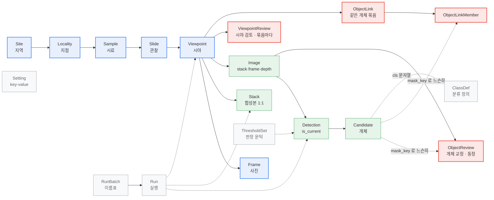
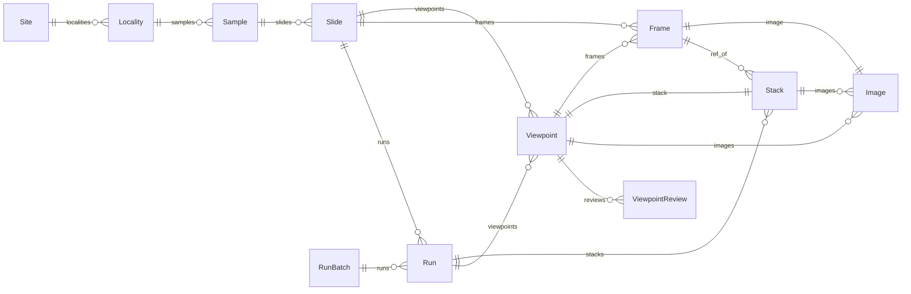
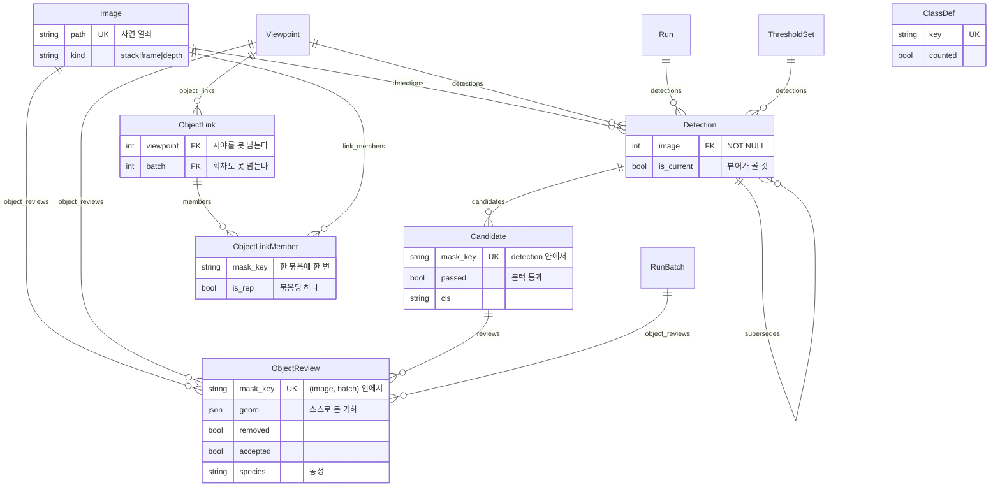
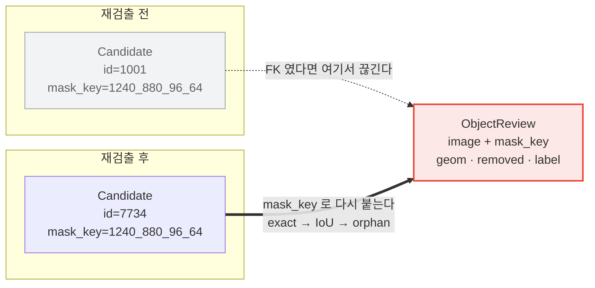
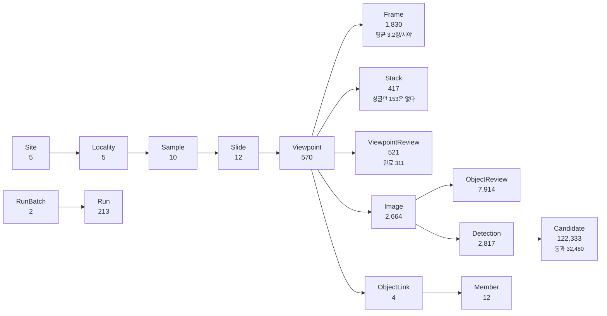

# DiaRUGA DB ERD — 한눈에

**2026-08-10** (`Image` 2026-08-05 — P06 · 층 개편 2026-08-06 — 063 ·
**묶음 2026-08-09 — `ObjectLink`, P11 · 카탈로그 2026-08-10 — 105**) · A3 가로

도표만 모았다. 칸의 뜻은 [DB 명세](20260810_db-specification.md), 관계 하나하나의
방향·`on_delete`·`related_name` 은 [ERD 문서](20260810_db-erd.md)에 있다.

원본은 `web/viewer/models.py` 이고, 이 그림들은 그 두 문서와 **같은 mermaid 원본**
에서 나온다 — 한쪽만 고쳐져 어긋나는 일이 없다.

**굽는 명령에 용지를 함께 준다.** `md2docx.py` 의 기본은 A4 세로라, 안 주면
머리말에 "A3 가로" 라고 적어 놓고 A4 세로가 나온다(실제로 그러고 있었다).

```bash
NODE_EXTRA_CA_CERTS=/etc/ssl/certs/ca-certificates.crt npm i --no-save @mermaid-js/mermaid-cli
MMDC=$(pwd)/node_modules/.bin/mmdc python tools/md2docx.py \
    docs/20260810_db-erd-poster.md --paper a3 --landscape
```

---

## 전체 그림

파랑이 줄기(시료 계통), 초록이 검출, 빨강이 사람의 교정, 회색이 설정과 이력이다.
실선은 소유(FK — 지우면 따라 지워진다), 점선은 참조이거나 FK 가 아예 아닌 것이다.



---

## 시료 계통과 이력



---

## 검출과 교정



---

## 사람의 교정은 왜 후보에 매이지 않는가



---

## 지금 담긴 것 (2026-08-10)


