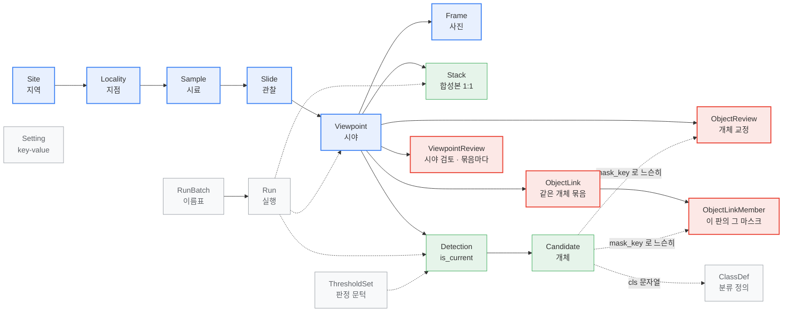
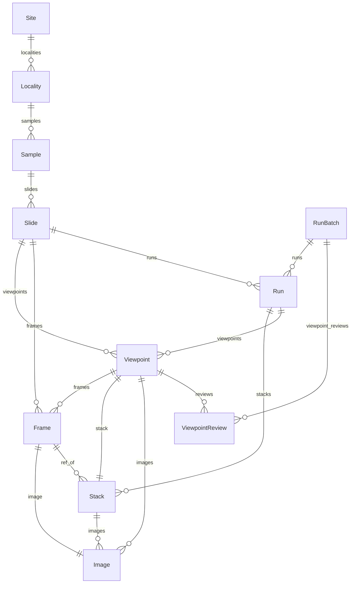
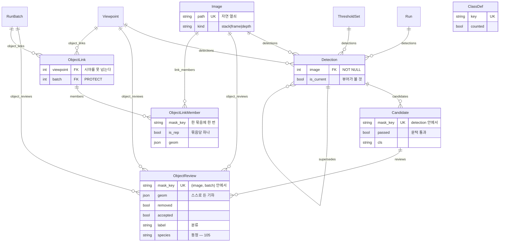
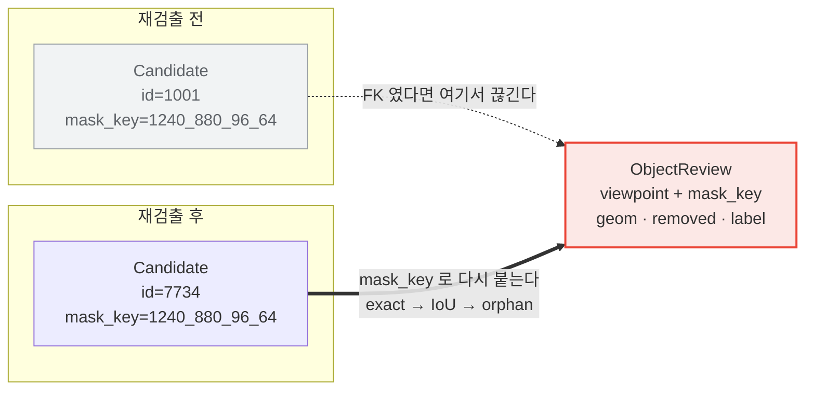
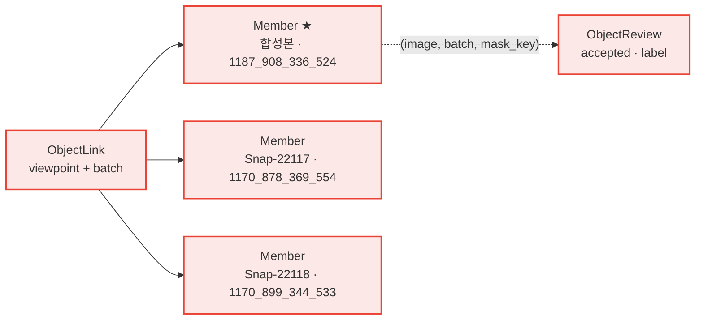
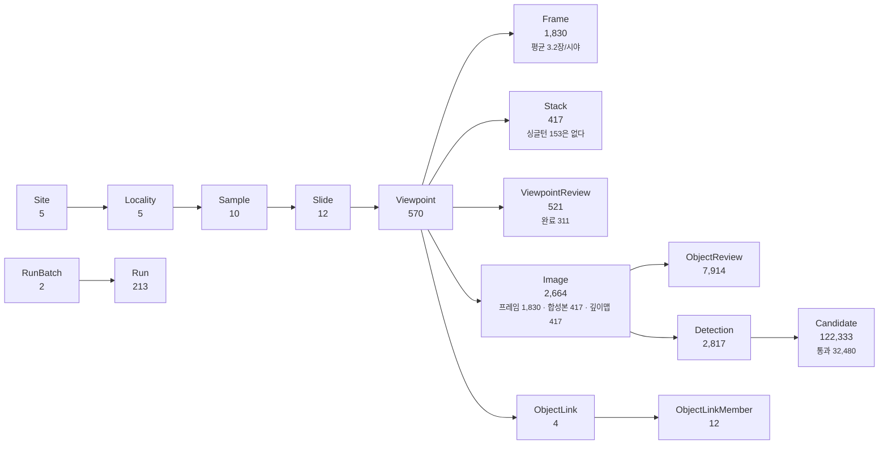

# DiaRUGA DB ERD

**2026-08-10** (`Image` 2026-08-05 — P06 · 층 개편 2026-08-06 — 063 ·
**묶음 2026-08-09 — `ObjectLink`, P11 · 카탈로그 2026-08-10 — 105**)

테이블 19개와 그 사이의 관계를 그린다. 각 칸의 뜻과 근거는
[DB 명세](20260810_db-specification.md)에 있고, 이 문서는 **무엇이 무엇에
매여 있는가**만 다룬다. 원본은 `web/viewer/models.py`.

도표만 크게 볼 것은 [ERD 한눈에](20260810_db-erd-poster.md) — 같은 원본에서
나오고 A3 가로로 뽑는다.

---

## 1. 전체 그림

굵은 줄기는 하나다 — **지역 → 지점 → 시료 → 관찰 → 시야 → 사진.** 폴더 이름
`RS23-GC03 71cm` 을 통짜 문자열로 두지 않고 갈라 담은 결과이고, 그래야 "같은
지점에서 위치에 따른 군집 변화" 나 "지역별 차이" 를 질의할 수 있다.

**지점(`Locality`)의 예전 이름이 `Core` 였고, 시료(`Sample`)는 2026-08-06 에
생겼다** (devlog 063). 그전에는 `Slide` 하나가 시료와 관찰을 겸했다.



<!-- 색: 파랑 = 시료 계통(줄기) · 초록 = 검출 · 빨강 = 사람의 교정 · 회색 = 설정과 이력 -->

**파랑**이 줄기(시료 계통), **초록**이 검출, **빨강**이 사람의 교정, **회색**이
설정과 이력이다. 실선은 소유(FK, 지우면 따라 지워진다), **점선은 참조이거나 FK 가
아예 아닌 것**이다. 특히 `Candidate ⇢ ObjectReview`·`⇢ ObjectLinkMember` 는 사람이 만든 것이
후보에 매여 있지 않다는 뜻이다 (§1.3).

**빨강이 넷이 됐다.** 교정(`ObjectReview`)·시야 검토(`ViewpointReview`)에
**같은 개체 묶음**(`ObjectLink`·`ObjectLinkMember`, P11)이 더해졌다. 넷 다
사람이 만든 것이라 **재생성 불가**이고 같은 규약을 따른다 — 마스크를 FK 가 아니라
`(image, batch, mask_key)` 로 짚고 `geom` 을 스스로 든다.

### 1.1 시료 계통과 이력

무엇이 무엇에 매이는지만 본다. **칸의 뜻은 [DB 명세](20260810_db-specification.md)**
에 있고, 유일 제약과 인덱스는 아래 §3 이다.



`Viewpoint ||--o{ Frame` 과 `Slide ||--o{ Frame` 이 **둘 다 있는 것**이 눈에 걸릴
수 있다. 사진은 슬라이드에 속하고(필수), 시야에는 그룹핑이 끝난 뒤에 붙는다(null).
그래서 그룹핑 전의 사진도 어디에 있는지 알 수 있다.

**`ViewpointReview` 는 더 이상 1:1 이 아니다** (073). "검토 완료" 는 **그 묶음의
검출을 다 봤다**는 말이라 묶음마다 한 줄이고, 시야 코멘트는 묶음을 갈아도 참이라
`batch=NULL` 줄 하나에 따로 앉는다. 한 줄에 담아 뒀더니 `sam2-전수` 에서 붙인
완료가 `yolo-3차` 화면에도 붙어 있었다 — 아직 아무도 안 본 검출이 "검토 완료" 로
보이고 "다음 미검토" 가 그 시야를 건너뛴다.

### 1.2 검출과 교정

여기서는 칸을 몇 개 적는다 — **이 테이블들의 성격이 칸 하나에 걸려 있기 때문이다**
(`is_current` · `passed` · `mask_key`).



**교정의 열쇠에 `batch` 가 들어 있다** (P09 5.1 · P10). 같은 마스크라도
`sam2-전수` 를 보며 한 판단과 `yolo-3차` 를 보며 한 판단은 다른 줄이다 — 안
가르면 SAM2 시절 "오검출" 이 YOLO 검출에 얹혀, 사람은 **자기가 지우지 않은 것이
지워져 있는 것**을 본다(실측 1,076건). `batch=NULL` 은 **사람이 그린 마스크**로,
어느 회차에도 속하지 않는다.

`ClassDef`(그림에서는 `CD` — mermaid 가 `classDef` 를 스타일 예약어로 쓴다) 와
`Setting` 은 어느 테이블과도 FK 로 매이지 않아 관계선이 없다 — `Candidate.cls` 와
`ObjectReview.label` 이 **문자열로** `ClassDef.key` 를 가리킬 뿐이다.
`check_db.py` 의 4번 검사가 그 느슨한 연결이 끊기지 않았는지 본다.

### 1.3 사람의 교정은 왜 점선인가



검출을 다시 돌리면 `Candidate` 행이 **전부 새로 생긴다.** FK 로 매었다면 그때마다
사람의 판단이 조인 실패로 사라진다. 그래서 진짜 키는 `(viewpoint, mask_key)` 이고,
`ObjectReview.candidate` 는 **바인딩 결과를 적어 둔 칸**일 뿐이다(`SET_NULL`).

교정 행은 `geom` 에 기하를 스스로 들고 있어 **검출기가 바뀌어도 읽힌다.** 실측으로
같은 설정이면 100 % 붙지만 엔진을 갈면 거의 0 이 된다 — 그때를 위한 설계다.

### 1.4 `Run` 은 아래로 가지를 뻗지 않는다

실행이 만든 것들(`Viewpoint` · `Stack` · `Detection`)이 **각자** `run` 을 가리킨다.
그래서 실행 하나를 지워도(`SET_NULL`) 산출물은 남는다 — 이력이 사라지는 것과
자료가 사라지는 것은 다르다.

### 1.5 같은 개체 묶음 (P11 · 2026-08-09)

한 시야는 스테이지가 안 움직인 상태라, **초점면 3~5장에 같은 규조각이 서너 번**
잡힌다. 그것이 하나라는 것을 `ObjectLink` 가 말한다.



- **묶음은 시야를 못 넘는다** — 다른 시야는 스테이지가 움직인 뒤라 "같은 자리"
  라는 근거 자체가 없다
- **회차도 못 넘는다** — 멤버가 `batch` 를 열쇠에 들고 묶음도 `batch` 에 매여
  있다. 같은 규조각이 두 회차에 잡혀 있어도 하나라고 말할 자리가 없다
  (TODOs · devlog 105 덧 — `YOLO 4차` 가 들어올 때 정한다)
- **멤버는 `ObjectReview` 와 같은 성격이다** — 열쇠가 같고 `geom` 을 스스로 들고
  FK 없이 값으로 만난다. 그래서 **둘을 `Object`/`MaskJudgement` 로 가르자는 안**이
  나와 있다 (`devlog/20260810_P12_object-and-judgement.md`)
- **분류는 묶음을 따라 번진다** (104) — 한 판에서 정하면 나머지 멤버의
  `ObjectReview.label` 에 같은 값이 앉는다. **종명은 아직 안 번진다**

---

## 2. 관계 33개

`related_name` 은 역방향으로 부를 이름이다 (`slide.viewpoints.all()`).

| from | 칸 | to | | 필수 | 지우면 | related_name |
|---|---|---|---|---|---|---|
| `Locality` | `site` | `Site` | N:1 | 필수 | **CASCADE** | `localities` |
| `Sample` | `locality` | `Locality` | N:1 | 필수 | **CASCADE** | `samples` |
| `Slide` | `sample` | `Sample` | N:1 | null | **SET_NULL** | `slides` |
| `Viewpoint` | `slide` | `Slide` | N:1 | 필수 | **CASCADE** | `viewpoints` |
| `Viewpoint` | `sharpest_frame` | `Frame` | N:1 | null | SET_NULL | `sharpest_of` |
| `Viewpoint` | `grouping_run` | `Run` | N:1 | null | SET_NULL | `viewpoints` |
| `Frame` | `slide` | `Slide` | N:1 | 필수 | **CASCADE** | `frames` |
| `Frame` | `viewpoint` | `Viewpoint` | N:1 | null | SET_NULL | `frames` |
| `Stack` | `viewpoint` | `Viewpoint` | **1:1** | 필수 | **CASCADE** | `stack` |
| `Stack` | `ref_frame` | `Frame` | N:1 | null | SET_NULL | `ref_of` |
| `Image` | `viewpoint` | `Viewpoint` | N:1 | null | **SET_NULL** | `images` |
| `Image` | `frame` | `Frame` | 1:1 | null | SET_NULL | `image` |
| `Image` | `stack` | `Stack` | N:1 | null | **CASCADE** | `images` |
| `Stack` | `run` | `Run` | N:1 | null | SET_NULL | `stacks` |
| `Detection` | `viewpoint` | `Viewpoint` | N:1 | 필수 | **CASCADE** | `detections` |
| `Detection` | `image` | `Image` | N:1 | **필수** | **CASCADE** | `detections` |
| `Detection` | `thresholds` | `ThresholdSet` | N:1 | null | SET_NULL | `detections` |
| `Detection` | `run` | `Run` | N:1 | null | SET_NULL | `detections` |
| `Detection` | `superseded_by` | `Detection` | N:1 | null | SET_NULL | `supersedes` |
| `Candidate` | `detection` | `Detection` | N:1 | 필수 | **CASCADE** | `candidates` |
| `ObjectReview` | `viewpoint` | `Viewpoint` | N:1 | 필수 | **CASCADE** | `object_reviews` |
| `ObjectReview` | `image` | `Image` | N:1 | **필수** | **CASCADE** | `object_reviews` |
| `ObjectReview` | `batch` | `RunBatch` | N:1 | null | **PROTECT** | `object_reviews` |
| `ObjectReview` | `candidate` | `Candidate` | N:1 | null | SET_NULL | `reviews` |
| `ViewpointReview` | `viewpoint` | `Viewpoint` | N:1 | 필수 | **CASCADE** | `reviews` |
| `ViewpointReview` | `batch` | `RunBatch` | N:1 | null | **PROTECT** | `viewpoint_reviews` |
| `ObjectLink` | `viewpoint` | `Viewpoint` | N:1 | 필수 | **CASCADE** | `object_links` |
| `ObjectLink` | `batch` | `RunBatch` | N:1 | null | **PROTECT** | `object_links` |
| `ObjectLinkMember` | `link` | `ObjectLink` | N:1 | 필수 | **CASCADE** | `members` |
| `ObjectLinkMember` | `image` | `Image` | N:1 | 필수 | **CASCADE** | `link_members` |
| `ObjectLinkMember` | `batch` | `RunBatch` | N:1 | null | **PROTECT** | (없음) |
| `Run` | `batch` | `RunBatch` | N:1 | null | SET_NULL | `runs` |
| `Run` | `slide` | `Slide` | N:1 | null | SET_NULL | `runs` |

### `CASCADE` · `SET_NULL` · `PROTECT` 를 가른 기준

**소유는 `CASCADE`, 참조는 `SET_NULL`, 그리고 사람의 판단이 매달린 곳은 `PROTECT`.**

- `Slide` 를 지우면 그 아래 시야·사진·검출·후보·교정이 **전부 따라 지워진다.**
  슬라이드 없는 시야는 뜻이 없기 때문이다. 그래서 슬라이드 삭제는 무겁다.
- 반대로 `Run`·`ThresholdSet`·`Frame`(참조) 은 **가리키기만 한다.** 실행 이력을
  지워도 검출은 남고, 문턱을 지워도 이미 판정된 후보는 그대로다.
- `Detection.superseded_by` 가 `SET_NULL` 인 것이 중요하다 — 옛 검출을 지울 때
  그것을 가리키던 **현재 검출이 딸려 가지 않는다.**
- **`Image` 의 두 `on_delete` 는 방향이 반대다.** 시야 가르기는 시야를 지우고 다시
  만드는데, **프레임은 원본 사진이라 살아남고**(`viewpoint` 가 `SET_NULL`)
  **합성본·깊이맵은 그 묶음에서 나온 것이라 무효다**(`stack` 이 `CASCADE`).
  이 테이블은 디스크의 파일을 비추고, 시야는 그 파일에 붙는 이름표다.
- `ObjectReview.candidate` 가 `SET_NULL` 인 것도 같은 뜻이다. 후보가 사라져도
  **사람의 교정은 남는다.** 재생성 불가한 자료이므로 이 방향은 양보할 수 없다.
- **`batch` 를 가리키는 넷은 `PROTECT` 다** (`ObjectReview`·`ViewpointReview`·
  `ObjectLink`·`ObjectLinkMember`). `SET_NULL` 로 조용히 잃으면 **어느 검출을
  보며 한 판단인지**가 사라지고, `batch=NULL` 은 이미 "사람이 그린 것" 이라는
  다른 뜻을 갖고 있어 두 가지가 섞인다. 회차를 지우려면 그것을 보며 만든 판단부터
  정리해야 한다 — 문은 `ops/drop_batch.py` 다.

---

## 3. 유일 제약과 인덱스

### 유일 제약

| 테이블 | 칸 | 왜 |
|---|---|---|
| `Site` | `code` | 지역 코드는 하나 |
| `Slide` | `slug` | URL 에 쓴다 |
| `ClassDef` | `key` | 분류 키는 하나 |
| `Setting` | `key` | |
| `RunBatch` | `(kind, label)` | 같은 종류에 같은 이름의 묶음은 하나 |
| `RunBatch` | `for_review` (참인 것만) | **검토 대상은 하나뿐** — 둘이면 화면마다 다른 판을 본다 (P10) |
| `RunBatch` | `code` (빈 것 제외) + `code ∉ {M, m}` | 카탈로그 번호 꼬리(`S1`·`Y3`). `M` 은 사람이 그린 개체 몫이라 회차가 못 가져간다 (105) |
| `Locality` | `(site, code)` | 지역이 다르면 `GC03` 이 겹쳐도 된다 |
| `Sample` | `(locality, code)` | 지점이 다르면 `71cm` 이 겹쳐도 된다 |
| `Viewpoint` | `(slide, idx)` | `g0` 은 슬라이드 안에서만 유일 |
| `Frame` | `(slide, name)` | **슬라이드를 넘으면 이름이 겹친다** — 실제로 143개가 겹쳤고, 슬라이드를 안 보고 이름만으로 찾다가 시야 12개가 엉뚱한 슬라이드에 붙었다 |
| `Candidate` | `(detection, mask_key)` | 한 검출 안에서 개체 키는 하나 |
| `Image` | `path` | **자연 열쇠** — 파일 하나에 행 하나 |
| `ObjectReview` | `(image, batch, mask_key)` (batch 있을 때) | **교정의 진짜 키** (P06 5a 에서 `viewpoint`→`image`, P09 5.1 에서 `batch` 추가) |
| `ObjectReview` | `(image, mask_key)` (batch 없을 때) | 사람이 그린 개체. SQLite 는 NULL 끼리 안 부딪힌다고 보므로 조건을 갈라 두 벌로 적는다 |
| `ViewpointReview` | `(viewpoint, batch)` / `(viewpoint)` (batch 없을 때) | 완료는 묶음마다, 코멘트는 시야에 하나 (073) |
| `ObjectLink` 멤버 | `(link, image)` | 같은 프레임의 마스크 둘이 한 개체일 수 없다 |
| `ObjectLink` 멤버 | `(image, batch, mask_key)` / `(image, mask_key)` | **한 마스크는 한 묶음에만** — 둘이 물면 "어느 개체냐" 에 답이 둘이 된다 |
| `ObjectLink` 멤버 | `link` (`is_rep` 인 것만) | 대표는 묶음당 하나. **0개는 DB 가 못 막아** 저장 쪽 약속이고 `check_db.py` 가 센다 |

### 인덱스

| 테이블 | 칸 | 무엇을 빠르게 하는가 |
|---|---|---|
| `Sample` | `(locality, depth_cm)` | 지점 안에서 깊이순 |
| `Slide` | `(sample, obs_no)` | 시료 안에서 관찰 번호순 |
| `Run` | `(kind, -started_at)` | 종류별 최근 실행 |
| `Detection` | `(viewpoint, is_current)` | **뷰어가 매 화면마다 하는 질의** |
| `Candidate` | `(detection, passed)` | 통과분만 그리기 |
| `Candidate` | `cls` · `major_um` · `texture` | 계측 표의 정렬·거르기 |
| `ObjectReview` | `(viewpoint, bind_method)` · `bind_method` | 재바인딩 결과 집계 |
| `ObjectReview` | `(image, batch)` · `source` | 화면이 한 판의 교정을 통째로 읽는다 · 그린 개체 추리기 |
| `Image` | `(viewpoint, kind)` | 캐러셀이 그 시야의 판들을 모은다 |
| `ObjectLink` | `viewpoint` | 검토 화면이 사슬 배지를 그린다 |
| `ObjectLinkMember` | `(image, batch)` | "이 판의 마스크들이 묶여 있나" |

---

## 4. 카디널리티 실측 (2026-08-10)

숫자가 관계를 설명한다.



- **`Viewpoint` 570 대 `Stack` 417** — 153개 시야는 사진이 한 장뿐이라(싱글턴)
  합성할 것이 없다. 그때는 그 한 장으로 검출을 돌린다.
- **`Image` 2,664 = 프레임 1,830 + 합성본 417 + 깊이맵 417.** 파일 하나에 행
  하나다. **깊이맵에는 검출이 붙지 않는다** — 종류가 스키마에 적혀 있다.
- **`Detection` 2,817 대 `Image` 2,664** — 한 이미지에 여러 묶음(SAM2 · YOLO 3차)의
  검출이 쌓인다. `is_current` 는 **그 묶음 안에서** 최신이라는 뜻이고, 어느 묶음을
  볼지는 `RunBatch.for_review` 가 정한다 (P10). **시야 하나에 현재 검출이
  여럿이다** — 합성본에 하나 + 프레임마다 하나.
- **`Candidate` 122,333 중 통과 32,480** (27 %). 나머지는 탈락분이고 지우지
  않는다 — 문턱을 바꾸면 `passed` 한 칸만 바뀐다.
- **`ObjectReview` 7,914** — 삭제 6,120 · 되살림 863 · 분류 지정 1,774 ·
  동정 0 · 메모 2 · 사람이 그린 개체 171 · 사람이 고친 기하 4. 바인딩은 전부
  `exact`.
- **`ViewpointReview` 521** — 완료 311(묶음마다 한 줄) + 시야 코멘트 6줄
  (`batch=NULL`).
- **`ObjectLink` 4 · 멤버 12** — 아직 손으로 만들기 시작한 참이다. 멤버 12건 중
  3건은 **교정 행 없이 묶기만 한 마스크**이고, 그것이 정상이다(묶음과 교정은
  각자 존재할 수 있다).

## 5. 이 문서의 그림에 대하여

도표는 **mermaid 로 쓴다.** 예전에는 ASCII 로 그렸는데 docx 로 옮기면 깨졌다 —
고정폭 글꼴을 줘도 한글과 罫線 문자의 폭이 맞지 않는다.

`md2docx.py` 가 ```` ```mermaid ```` 블록을 만나면 `mmdc` 로 PNG 를 구워 그 자리에
넣는다(`docs/assets/mermaid-<해시>.png`). 원본이 같으면 다시 굽지 않는다.
**구운 그림은 저장소에 함께 넣는다.** 해시가 같으면 다시 굽지 않으므로, `mmdc`
가 없는 장비에서도 같은 docx 가 나온다. 그림이 없고 `mmdc` 도 없으면 코드 블록으로
떨어진다 — 변환이 실패하는 것보다 낫다.

```bash
npm i @mermaid-js/mermaid-cli
MMDC=$(pwd)/node_modules/.bin/mmdc python tools/md2docx.py docs/20260810_db-erd.md
```

**원본은 이 문서 안의 mermaid 한 벌뿐이다.** 그림 파일은 그것에서 나온 산출물이라
따로 손대지 않는다.
